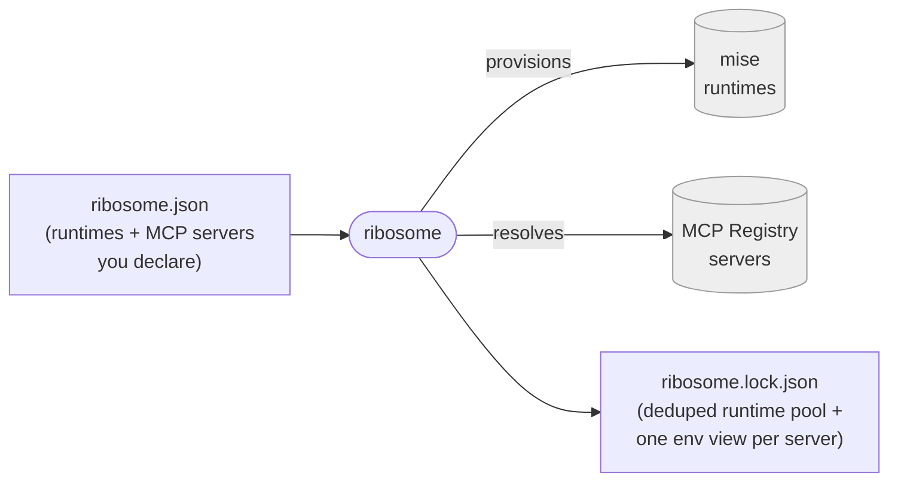

# ribosome

**The MCP package manager.** One manifest declares the language runtimes *and*
the MCP servers a project needs; ribosome resolves them together, deduplicates
shared runtimes, and pins everything into one reproducible lockfile — **before
any workflow runs**, so a missing tool or unresolvable server fails at
validation time, not mid-execution.

[](https://github.com/medullaflow/ribosome/actions/workflows/ci.yml)
[](https://www.npmjs.com/package/@medullaflow/ribosome)
[](https://www.npmjs.com/package/@medullaflow/ribosome)
[](https://www.mozilla.org/en-US/MPL/2.0/)
[](#status)

---

## The problem

Today, standing up a project that uses MCP servers means doing two unrelated
jobs by hand:

1. **Install the language runtimes** the servers need — Node for one, Python
   for another — with `mise`/`asdf`/`nix`, tracked separately from your MCP
   config and easy to get out of sync.
2. **Configure each MCP server** in `.mcp.json` or editor config: a raw
   `command`/`args` per server, with no shared version policy, no dedup when
   ten servers all want `node@24`, and nothing pinned.

Nothing ties the two together. Nothing tells you *up front* that a server needs
a runtime you don't have, or resolves a registry reference to a concrete
version. You find out when something fails halfway through a run.

## The solution

ribosome is the missing layer: a **package manager for the whole MCP
dependency surface — runtimes and servers, together.**



**Conform on the config axis, compete on the runtime axis.** ribosome's
`mcpServers` section is a compatible *superset* of existing MCP config formats —
so it's not "yet another way to list servers." Its unique value is the runtime
provisioning and upfront resolution those formats don't do.

### ribosome vs. wiring it up by hand

| | By hand (mise + `.mcp.json`) | ribosome |
|---|---|---|
| Runtimes and servers | Two separate, unsynced configs | **One manifest** |
| Shared runtime (10 servers, one `node@24`) | Configured/installed per server | **Deduped — one pool entry, one install** |
| A server's runtime | You restate it in your config | **Derived from the registry's `server.json`** |
| Registry reference → concrete version | Manual lookup | **Resolved and pinned** |
| Missing tool / unresolvable server | Fails mid-run | **Fails at validation time, up front** |
| Reproducibility | None built in | **One lockfile, all failures reported at once** |

## Quickstart

**The mental model** — a package manager for MCP. You write a manifest, then
resolve it into a lockfile:

```bash
npx @medullaflow/ribosome resolve   # reads ribosome.json → writes ribosome.lock.json
npx @medullaflow/ribosome prune     # drop runtimes no project references anymore
```

> **No install needed** — `npx` fetches and runs the CLI from npm on the fly.
> For repeat use: `npm install -g @medullaflow/ribosome` puts a plain
> `ribosome` command on `PATH`. A standalone binary requiring no Node at all
> is the [Distribution](https://github.com/medullaflow/ribosome/milestones)
> (beta) track, still in progress — see [Development](#development) to run
> from a clone in the meantime (`bun bin/ribosome.ts resolve`).

**Embedding the resolver as a library** — what a host orchestrator does
instead of shelling out to the CLI:

```bash
npm install @medullaflow/ribosome
```

```typescript
import {
  validateManifest,   // re-exported from @medullaflow/ribosome-schema
  Materializer,
  MiseEnvironmentProvider,
  OfficialMcpRegistry,
  writeLockfile,       // optional: persist the result to ribosome.lock.json
} from "@medullaflow/ribosome";

// 1. Validate untyped input against the normative schema — throws listing every
//    error at once, offline (no network round-trip).
const manifest = validateManifest(JSON.parse(rawRibosomeJson));

// 2. Wire the adapters you want (mise here; swap freely) and materialize.
const materializer = new Materializer({
  environmentProvider: new MiseEnvironmentProvider(),
  registries: [new OfficialMcpRegistry()],
});

const lock = await materializer.materialize(manifest, { cwd: projectRoot });
// lock.runtimePool — deduplicated runtimes, exact versions
// lock.project     — the project's environment view (pathPrepend + envVars)
// lock.mcpServers  — resolved servers: launch command + isolated environment

// 3. Optional: persist it, the same way the CLI's own `resolve` command does.
await writeLockfile(lock, projectRoot);
```

Everything above is real and integration-tested against a real `mise` install
and the live MCP registry — see [`test/convergence.test.ts`](test/convergence.test.ts).

## The manifest — `ribosome.json`

The full, normative format is the **[ribosome standard
(ribosome-schema)](https://github.com/medullaflow/ribosome-schema)** — ribosome
is the package manager; the schema is the manifest/lockfile format it reads.

```jsonc
{
  "$schema": "https://schema.ribosome.medullaflow.org/v1/manifest.schema.json",
  "schemaVersion": "1",

  // Tool versions for your project — and the version policy for MCP runtimes.
  "runtimes": { "node": "24", "python": "3.12" },

  // Named MCP registries to resolve against.
  "registries": {
    "default": "official",
    "sources": { "official": { "url": "https://registry.modelcontextprotocol.io" } }
  },

  "mcpServers": {
    // Resolve from a registry by reverse-DNS name; the registry's server.json
    // determines runtime, transport and launch.
    "fs": { "source": "registry", "name": "io.modelcontextprotocol/filesystem", "version": "1.2.0" },

    // A custom server, described with a full standard server.json (declares its
    // own runtime/packages; migrates cleanly to a registry later).
    "custom": { "source": "inline", "server": { /* server.json */ } },

    // Copy-paste bridge from .mcp.json / editor config.
    "legacy": { "source": "process", "command": "npx", "args": ["-y", "@foo/bar"] }
  }
}
```

## How it works

ribosome is a [ports & adapters](https://alistair.cockburn.us/hexagonal-architecture/)
design, coupled to no concrete tool:

| Layer | Role |
|-------|------|
| **[ribosome-schema](https://github.com/medullaflow/ribosome-schema)** (external) | The standard: normative JSON Schemas, generated types, validation. |
| **ports** | Abstractions: `EnvironmentProvider`, `McpRegistry`. |
| **adapters** | Concretions: mise, the official MCP registry. Swappable. |
| **orchestrator** | The phased pipeline that emits the lockfile. |

Runtimes are deduplicated into a **shared pool**; the project and each MCP server
get an **isolated environment view** over it. An MCP server's runtime is
**derived from the registry** (`server.json`), not restated by you.

**→ Full design, diagrams, and decisions: [docs/ARCHITECTURE.md](docs/ARCHITECTURE.md).**
**→ The versioned library integration contract: [docs/API.md](docs/API.md).**

```
src/
├── ports/         abstractions — EnvironmentProvider, McpRegistry
├── adapters/      concretions — mise/, mcp-registry/
└── orchestrator/  the phased materialization pipeline
```

## Status

**Alpha.** The resolution pipeline and npm library distribution are real and
live; binary distribution across platforms is the beta track.

| Part | State |
|------|-------|
| The standard ([ribosome-schema](https://github.com/medullaflow/ribosome-schema)): schemas, validation, conformance corpus | **Real** — tested, in its own repo |
| Ports (`EnvironmentProvider`, `McpRegistry`) | **Real** interfaces |
| `MiseEnvironmentProvider` | **Real** — integration-tested against a real mise install |
| `OfficialMcpRegistry` + the phased `Materializer` pipeline | **Real** — integration-tested against the live MCP registry, convergence-tested end-to-end ([`test/convergence.test.ts`](test/convergence.test.ts)) |
| CLI (`ribosome` command) | **Real**, two entry points sharing one implementation ([`src/cli.ts`](src/cli.ts)): `npx @medullaflow/ribosome` / `npm install -g` (tsc → `dist/cli.js`, tested [`test/cli-node.test.ts`](test/cli-node.test.ts)) and the standalone-binary target (`bin/ribosome.ts`, `bun build --compile`, tested [`test/cli.test.ts`](test/cli.test.ts)). Per-platform packaged binaries are the remaining beta-track piece. |
| Test-adequacy + review guardrails | **Real** — per-file coverage floor, an advisory mutation-score signal, and a required code-owner review gate |
| npm package | **Published** — [`@medullaflow/ribosome`](https://www.npmjs.com/package/@medullaflow/ribosome); `v0.1.1` went through the fully automated OIDC publish pipeline, `smoke-test` included |

See the [Distribution](https://github.com/medullaflow/ribosome/milestones)
milestone and [ROADMAP.md](ROADMAP.md) for what's next.

<details>
<summary><strong>What "alpha", "beta", and "v1/GA" mean here</strong></summary>

### What "alpha" meant

This package cleared its own alpha bar — kept as a record of what that bar was,
not a live checklist:

1. ✅ **A CLI exists** and can be invoked directly, not only embedded as a
   library — [`bin/ribosome.ts`](bin/ribosome.ts).
2. ✅ **It's installable** by someone who isn't cloning this repo —
   `npm install @medullaflow/ribosome`, published via
   [`publish-npm.yml`](.github/workflows/publish-npm.yml)'s OIDC trusted
   publishing.
3. ✅ **Install documentation exists** — see [Quickstart](#quickstart).
4. ✅ **A released artifact has been verified to actually run**: `v0.1.1`'s
   `smoke-test` job installed the real published tarball into an isolated
   project and exercised its real exports — not just "it compiled."
5. ✅ **The test-adequacy and human-review guardrails are in place**: a coverage
   floor plus a mutation-adequacy signal, and a required code-owner review gate.

Not gated on full three-platform binary packaging, signed installers,
SBOM/provenance, or package-manager distribution — those are beta-track
expansion, tracked in the
[Distribution](https://github.com/medullaflow/ribosome/milestones) milestone.

### What "beta" means

Alpha proves one distribution track works end-to-end. Beta means **both tracks
are real, and someone other than this repo depends on it**:

1. **All three binary platforms are packaged and released through one
   orchestration workflow** — Windows
   ([#7](https://github.com/medullaflow/ribosome/issues/7)), Linux
   ([#10](https://github.com/medullaflow/ribosome/issues/10)), macOS
   ([#11](https://github.com/medullaflow/ribosome/issues/11)), tied together by
   [#14](https://github.com/medullaflow/ribosome/issues/14).
2. **A packaged binary is genuinely zero-setup**: `mise` is vendored into every
   artifact ([#8](https://github.com/medullaflow/ribosome/issues/8)) rather than
   assumed on `PATH`, with drift-detection
   ([#9](https://github.com/medullaflow/ribosome/issues/9)) keeping the pin
   fresh.
3. **Every artifact has a checksum + build-provenance attestation**
   ([#12](https://github.com/medullaflow/ribosome/issues/12)) and an automated
   install-and-run smoke test
   ([#13](https://github.com/medullaflow/ribosome/issues/13)).
4. **Install docs cover both tracks**
   ([#15](https://github.com/medullaflow/ribosome/issues/15)).
5. **SBOM generation is live**
   ([#77](https://github.com/medullaflow/ribosome/issues/77)).
6. **A real external consumer depends on a published release, not a local
   link** — some project outside this repo resolves ribosome via its published
   npm version, not a `file:`/workspace reference. Guardrails prove this repo
   trusts itself; an outside consumer shipping against a release proves someone
   else can too.

Not gated on a signed macOS installer
([#17](https://github.com/medullaflow/ribosome/issues/17)) or package-manager
distribution ([#16](https://github.com/medullaflow/ribosome/issues/16)) — both
are deliberately deferred.

### What "v1 / GA" means

Beta means it works everywhere and someone depends on it. GA means **a
compatibility promise**:

1. **A documented compatibility policy for ribosome's own exported surface** —
   `Materializer`, the ports, and the CLI's subcommands/flags — distinct from
   [ribosome-schema](https://github.com/medullaflow/ribosome-schema)'s own
   `schemaVersion`/`SPEC.md`, which already makes that promise for the
   manifest/lockfile *shape*.
2. **Sustained, breaking-change-free real usage**: an external consumer runs
   against a released version for a meaningful stretch without an
   unreleased/patched fix.
3. **The remaining deferred Distribution scope lands**: a signed macOS installer
   ([#17](https://github.com/medullaflow/ribosome/issues/17)) and at least one
   native package-manager channel
   ([#16](https://github.com/medullaflow/ribosome/issues/16)).
4. **A docs site is live**
   ([#51](https://github.com/medullaflow/ribosome/issues/51)).
5. **The test-adequacy signals hold steady release over release** — the coverage
   floor stays enforced and the mutation score doesn't regress.

Check the milestones for current state — this is the bar, not a snapshot of it.

</details>

## Two repos, on purpose

- **[ribosome-schema](https://github.com/medullaflow/ribosome-schema)** — the
  *standard*: normative JSON Schemas for `ribosome.json`/`ribosome.lock.json`, a
  conformance corpus, and a TypeScript binding. **Apache-2.0**, so anyone can
  implement the standard with no copyleft obligation.
- **ribosome (this repo)** — the *reference package manager / resolver*:
  pluggable runtime + MCP registry provisioning and the materialization
  pipeline. **MPL-2.0** — see [Licensing](#licensing).

Think npm-the-CLI vs. the `package.json` format: ribosome is the tool, the
schema is the format it reads. ribosome depends on
`@medullaflow/ribosome-schema` as an ordinary package and carries **no schema,
no JSON Schema files, no conformance fixtures** of its own.

## Development

```bash
git clone https://github.com/medullaflow/ribosome && cd ribosome

bun install     # also wires the pre-commit SPDX-header + lint check
bun run build   # tsc — the type-checked source of dist/, the npm-embeddable artifact
bun run test    # build, then run the real test suite (includes a live mise integration test)
bun run compile # bun build --compile — proves the standalone-binary path still works
bun run lint    # Biome — lint + format + import-organize check

bun bin/ribosome.ts resolve   # run the CLI directly from source
```

This repo's own dev/build/test toolchain runs entirely on **[bun](https://bun.sh)**,
not Node — see [`docs/ARCHITECTURE.md` D14](docs/ARCHITECTURE.md#design-decisions).
`tsc` still emits a plain, portable `dist/` for embedding in any Node/TS host:
bun is this repo's own toolchain choice, not a requirement placed on consumers.

See [CONTRIBUTING.md](CONTRIBUTING.md) for the contribution/attribution workflow
and DCO sign-off.

### Built by humans and agents, together

This repo is designed to be developed by **people and LLM coding agents side by
side** — most of its code is agent-authored. That shapes how it's built:
conventions the standard tooling can only *suggest* are converted into
deterministic, machine-enforced guardrails (linting, architectural boundary
checks, type-safety and test-adequacy gates), so a change can't merge while
breaking the architecture regardless of who or what wrote it.

Agents working in this repo should read **[AGENTS.md](AGENTS.md)** first — the
machine-readable operating contract. It's the agent-facing counterpart to
`CONTRIBUTING.md`.

## Why "ribosome"?

Ribosomes are the cell's dependency materializers: they take a declaration
(mRNA) and turn it into working machinery (proteins). Same idea here.

## Licensing

**MPL-2.0** — see [LICENSE](LICENSE) and [NOTICE](NOTICE), and
[CONTRIBUTING.md](CONTRIBUTING.md#why-mpl-20) for the reasoning. This repo is the
reference *implementation*; the *standard* it implements
([ribosome-schema](https://github.com/medullaflow/ribosome-schema)) is a
separate, Apache-2.0 repo.

ribosome is designed to be embedded in a host orchestrator, and to be reusable
standalone.

## Built on

ribosome provisions runtimes and MCP servers by orchestrating existing, focused
tools rather than reimplementing them:

- **[mise](https://github.com/jdx/mise)** — runtime version management
- **[MCP Registry](https://github.com/modelcontextprotocol/registry)** — the
  official Model Context Protocol server registry

Full third-party attribution: [NOTICE](NOTICE). See
[docs/ARCHITECTURE.md](docs/ARCHITECTURE.md) for how the pieces fit together.

## Attribution

**Primary author:** Matteo Lacchio — [@ookmash](https://github.com/ookmash).
Principal authorship and copyright: [AUTHORS](AUTHORS). Full contributor list:
the [Contributors graph](https://github.com/medullaflow/ribosome/graphs/contributors).

---

Made by Matteo Lacchio and Contributors.
