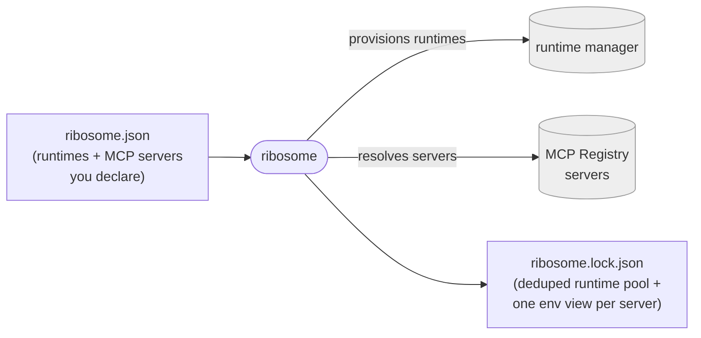

# ribosome

**The MCP package manager.** One manifest declares the language runtimes *and*
the MCP servers a project needs; ribosome resolves them together, deduplicates
shared runtimes, and pins everything into one reproducible lockfile — **before
any workflow runs**, so a missing tool or unresolvable server fails at
validation time, not mid-execution.

[](https://github.com/medullaflow/ribosome/actions/workflows/ci.yml)
[](https://www.npmjs.com/package/@medullaflow/ribosome)
[](https://www.npmjs.com/package/@medullaflow/ribosome)
[](https://www.mozilla.org/en-US/MPL/2.0/)
[](ROADMAP.md)

**[Full documentation →](https://ribosome.medullaflow.org)** — quickstart, CLI
reference, manifest reference, library API, and an architecture walkthrough.

---

## The problem

Standing up a project that uses MCP servers means doing two unrelated jobs by
hand:

1. **Install the language runtimes** the servers need — Node for one, Python
   for another — with a runtime manager, tracked separately from your MCP
   config and easy to get out of sync.
2. **Configure each MCP server** in `.mcp.json` or editor config: a raw
   `command`/`args` per server, with no shared version policy, no dedup when
   ten servers all want `node@24`, and nothing pinned.

Nothing ties the two together. Nothing tells you *up front* that a server needs
a runtime you don't have, or resolves a registry reference to a concrete
version. You find out when something fails halfway through a run.

## The solution

ribosome is the missing layer: a **package manager for the whole MCP
dependency surface — runtimes and servers, together.**



**Conform on the config axis, compete on the runtime axis.** ribosome's
`mcpServers` section is a compatible *superset* of existing MCP config formats —
so it's not "yet another way to list servers." Its unique value is the runtime
provisioning and upfront resolution those formats don't do.

### ribosome vs. wiring it up by hand

| | By hand | ribosome |
|---|---|---|
| Runtimes and servers | Two separate, unsynced configs | **One manifest** |
| Shared runtime (10 servers, one `node@24`) | Configured/installed per server | **Deduped — one pool entry, one install** |
| A server's runtime | You restate it in your config | **Derived from the registry's `server.json`** |
| Registry reference → concrete version | Manual lookup | **Resolved and pinned** |
| Missing tool / unresolvable server | Fails mid-run | **Fails at validation time, up front** |
| Reproducibility | None built in | **One lockfile, all failures reported at once** |

## Quickstart

Write a manifest, then resolve it into a lockfile:

```bash
npx @medullaflow/ribosome resolve   # reads ribosome.json → writes ribosome.lock.json
npx @medullaflow/ribosome prune     # drop runtimes no project references anymore
```

> **No install needed** — `npx` fetches and runs the CLI from npm on the fly.
> For repeat use: `npm install -g @medullaflow/ribosome` puts a plain
> `ribosome` command on `PATH`. Standalone, no-runtime-required binaries are
> the beta [Distribution](https://github.com/medullaflow/ribosome/milestones)
> track — see [ROADMAP.md](ROADMAP.md).

A minimal `ribosome.json`:

```jsonc
{
  "$schema": "https://schema.ribosome.medullaflow.org/v1/manifest.schema.json",
  "schemaVersion": "1",

  // Tool versions for your project — and the version policy for MCP runtimes.
  "runtimes": { "node": "24", "python": "3.12" },

  // Named MCP registries to resolve against.
  "registries": {
    "default": "official",
    "sources": { "official": { "url": "https://registry.modelcontextprotocol.io" } }
  },

  "mcpServers": {
    // Resolve from a registry by reverse-DNS name; the registry's server.json
    // determines runtime, transport and launch.
    "fs": { "source": "registry", "name": "io.modelcontextprotocol/filesystem", "version": "1.2.0" },

    // A custom server, described with a full standard server.json (declares its
    // own runtime/packages; migrates cleanly to a registry later).
    "custom": { "source": "inline", "server": { /* server.json */ } },

    // Copy-paste bridge from .mcp.json / editor config.
    "legacy": { "source": "process", "command": "npx", "args": ["-y", "@foo/bar"] }
  }
}
```

Full field reference: **[the manifest reference](https://ribosome.medullaflow.org/reference/manifest/)**.

## Use as a library

A host orchestrator can embed the resolver directly instead of shelling out to
the CLI:

```bash
npm install @medullaflow/ribosome
```

```typescript
import {
  validateManifest,   // validate untyped input against the normative schema
  Materializer,
  MiseEnvironmentProvider,
  OfficialMcpRegistry,
  writeLockfile,       // optional: persist the result to ribosome.lock.json
} from "@medullaflow/ribosome";

// 1. Validate — throws listing every error at once, offline (no network).
const manifest = validateManifest(JSON.parse(rawRibosomeJson));

// 2. Wire the adapters you want (the reference ones here; swap freely) and
//    materialize.
const materializer = new Materializer({
  environmentProvider: new MiseEnvironmentProvider(),
  registries: [new OfficialMcpRegistry()],
});

const lock = await materializer.materialize(manifest, { cwd: projectRoot });
// lock.runtimePool — deduplicated runtimes, exact versions
// lock.project     — the project's environment view (pathPrepend + envVars)
// lock.mcpServers  — resolved servers: launch command + isolated environment

// 3. Optional: persist it, the same way the CLI's own `resolve` command does.
await writeLockfile(lock, projectRoot);
```

Everything above is integration-tested against a real runtime-manager install
and the live MCP registry. Full contract: **[the library API
reference](https://ribosome.medullaflow.org/reference/api/)**.

## How it works

ribosome is a [ports & adapters](https://alistair.cockburn.us/hexagonal-architecture/)
design, coupled to no concrete tool:

| Layer | Role |
|-------|------|
| **schema** | The standard: normative JSON Schemas, generated types, validation. Consumed as a dependency. |
| **ports** | Abstractions: `EnvironmentProvider`, `McpRegistry`. |
| **adapters** | Concretions: a runtime manager, the official MCP registry. Swappable. |
| **orchestrator** | The phased pipeline that emits the lockfile. |

Runtimes are deduplicated into a **shared pool**; the project and each MCP server
get an **isolated environment view** over it. An MCP server's runtime is
**derived from the registry** (`server.json`), not restated by you.

**→ Full design, diagrams, and rationale: [docs/ARCHITECTURE.md](docs/ARCHITECTURE.md)
and [docs/API.md](docs/API.md).**

```
src/
├── ports/         abstractions — EnvironmentProvider, McpRegistry
├── adapters/      concretions — a runtime-manager provider, mcp-registry adapters
└── orchestrator/  the phased materialization pipeline
```

## Status

**Alpha** — the resolution pipeline and the npm library are real and live;
cross-platform binary distribution is the beta track. Full maturity bars and
what's real today: **[ROADMAP.md](ROADMAP.md)** · live milestones on
[GitHub](https://github.com/medullaflow/ribosome/milestones).

<details>
<summary><strong>macOS: bypassing Gatekeeper for the unsigned zip</strong></summary>

macOS packaging ships as a plain zip, deliberately unsigned and unnotarized
for now (a signed, notarized `.pkg`/`.dmg` needs a paid Apple Developer
account). The first time you run a binary extracted from it, Gatekeeper blocks
it with "`ribosome` cannot be opened because the developer cannot be
verified." To run it anyway, either:

- Right-click (or Control-click) the `ribosome` binary in Finder → **Open** →
  **Open** again in the confirmation dialog, or
- Clear the quarantine attribute from a terminal:
  `xattr -d com.apple.quarantine /path/to/ribosome`

Either only needs doing once per binary.

</details>

<details>
<summary><strong>Verifying a downloaded artifact</strong></summary>

Every release asset ships alongside a `SHA256SUMS` manifest and a GitHub
build-provenance attestation — no code signature yet, but both are
independently verifiable without trusting the download channel itself.

Checksum, from the directory holding both the artifact and `SHA256SUMS`:

```sh
sha256sum -c SHA256SUMS --ignore-missing
```

Provenance, with the [GitHub CLI](https://cli.github.com/):

```sh
gh attestation verify <downloaded-file> --repo medullaflow/ribosome
```

Both confirm the file wasn't corrupted or tampered with in transit and was
genuinely built by this repo's own release workflow — neither confirms the
publisher's identity the way a code signature would.

</details>

## Development

```bash
git clone https://github.com/medullaflow/ribosome && cd ribosome

bun install     # also wires the pre-commit SPDX-header + lint check
bun run build   # tsc — the type-checked source of dist/, the npm-embeddable artifact
bun run test    # build, then run the real test suite (includes a live integration test)
bun run compile # bun build --compile — proves the standalone-binary path still works
bun run lint    # Biome — lint + format + import-organize check

bun bin/ribosome.ts resolve   # run the CLI directly from source
```

This repo's own dev/build/test toolchain runs on **[bun](https://bun.sh)**, not
Node; `tsc` still emits a plain, portable `dist/` for embedding in any Node/TS
host. bun is this repo's own toolchain choice, not a requirement placed on
consumers.

See [CONTRIBUTING.md](CONTRIBUTING.md) for the contribution/attribution
workflow and DCO sign-off.

### Built by humans and agents, together

This repo is designed to be developed by **people and LLM coding agents side by
side** — most of its code is agent-authored. That shapes how it's built:
conventions the standard tooling can only *suggest* are converted into
deterministic, machine-enforced guardrails (linting, architectural boundary
checks, type-safety and test-adequacy gates), so a change can't merge while
breaking the architecture regardless of who or what wrote it.

Agents working in this repo should read **[AGENTS.md](AGENTS.md)** first — the
machine-readable operating contract, the agent-facing counterpart to
`CONTRIBUTING.md`.

## Why "ribosome"?

Ribosomes are the cell's dependency materializers: they take a declaration
(mRNA) and turn it into working machinery (proteins). Same idea here.

## The standard, and the tool

ribosome is the *tool*; the manifest/lockfile *format* it reads is defined by a
separate standard, the **ribosome schema** — think npm-the-CLI vs. the
`package.json` format. The schema lives in its own
[repository](https://github.com/medullaflow/ribosome-schema) under a permissive
(Apache-2.0) license so anyone can implement it, and ribosome depends on it as
an ordinary package — carrying no schema files of its own. You don't need to
read that repo to use ribosome; the [manifest
reference](https://ribosome.medullaflow.org/reference/manifest/) is enough.

## Licensing

**MPL-2.0** — see [LICENSE](LICENSE), [NOTICE](NOTICE), and
[CONTRIBUTING.md](CONTRIBUTING.md#why-mpl-20) for the reasoning. ribosome is
designed to be embedded in a host orchestrator and to be reusable standalone.

## Built on

ribosome provisions runtimes and MCP servers by orchestrating existing, focused
tools rather than reimplementing them:

- **[mise](https://github.com/jdx/mise)** — the reference runtime version manager
  behind `MiseEnvironmentProvider`
- **[MCP Registry](https://github.com/modelcontextprotocol/registry)** — the
  official Model Context Protocol server registry

Full third-party attribution: [NOTICE](NOTICE).

## Attribution

**Primary author:** Matteo Lacchio — [@ookmash](https://github.com/ookmash).
Principal authorship and copyright: [AUTHORS](AUTHORS). Full contributor list:
the [Contributors graph](https://github.com/medullaflow/ribosome/graphs/contributors).

---

Made by Matteo Lacchio and Contributors.
