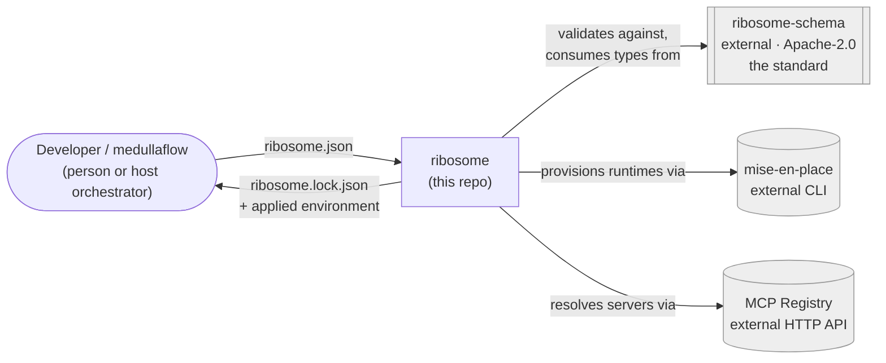
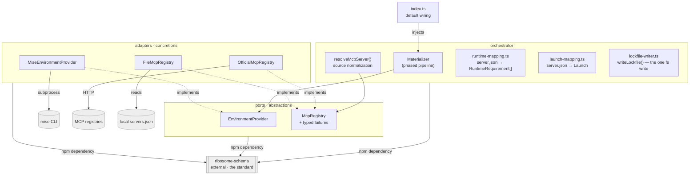
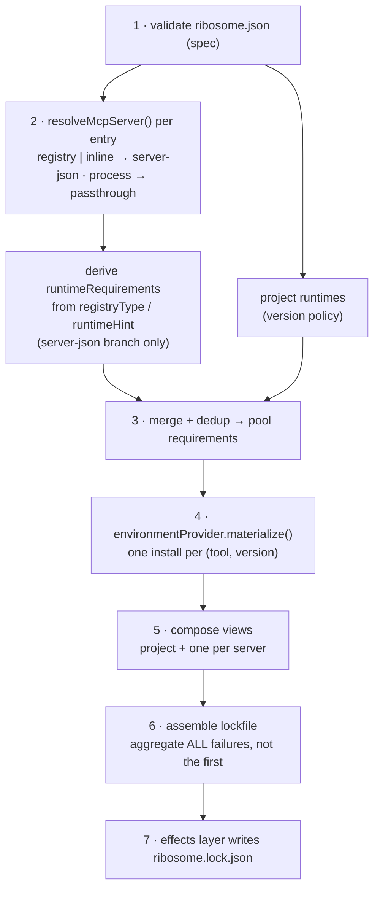

# Architecture

> Reference map of ribosome's design. If you're new here, read this top to
> bottom once; afterwards, the [decisions table](#design-decisions) and the
> [dependency rules](#dependency-rules) are what you'll come back to.

## What ribosome is (and the niche it fills)

ribosome turns a **declaration** of a project's tools and MCP servers into
**working, materialized machinery** — up front, before any workflow runs, so a
missing tool or unresolvable server fails at validation time, not mid-execution.

The ecosystem already has runtime managers (mise, asdf, nix) and MCP clients
that read `server.json` and launch servers. **Nobody does the unified, upfront
materialization**: runtimes *and* MCP servers, resolved together, deduplicated
into a shared pool, pinned into one reproducible lockfile. That is ribosome's
niche.

Positioning rule of thumb: **conform on the config axis, compete on the runtime
axis.** ribosome is not "another way to list MCP servers" — its `mcpServers`
section is deliberately a compatible superset of existing formats. Its unique
value is the runtime provisioning those formats don't provide.

## Architecture at a glance

Two diagrams, following the [C4 model](https://c4model.com/)'s levels of
abstraction (Context, then Container) — Mermaid rather than the model's own
notation, since GitHub renders Mermaid code fences natively with no external
tool or stale image export, and a flowchart is more reliably rendered across
Mermaid versions than the newer, less consistently-supported `C4Context`/
`C4Container` diagram types. This pairing (C4 for structure, an ADR-style log
for rationale) is the same one used to keep the [decisions table](#design-decisions)
below meaningful instead of just a wall of text.

**Level 1 — Context.** ribosome as one box among the systems it talks to.
Everything on the standard/schema side is intentionally a single external
node here — its own internals are out of scope for *this* repo's diagram;
see [ribosome-schema](https://github.com/medullaflow/ribosome-schema) for that.



**Level 2 — Container.** Zoomed into ribosome itself: the ports & adapters
structure. The standard is still a single unexpanded box — it's a dependency
boundary, not something this diagram explains the inside of.



`runtime-mapping.ts`, `resolve-mcp-server.ts`, and `launch-mapping.ts` live in
`orchestrator/`, not `adapters/`, despite being about the MCP registry domain:
all three are pure logic over the standard's own types (`McpServerJson`), with
zero knowledge of a concrete registry or tool, so the orchestrator may depend
on them directly without violating [dependency rule 1](#dependency-rules) (see
[D20](#design-decisions)).

Every arrow inside ribosome points **inward toward the orchestrator core**;
the concrete tools (mise, the registries) sit at the very edge, reachable
only through their own adapter.

## Two repos

The standard and the reference implementation are **separate repos with
separate licenses** — not a layering detail, a load-bearing decision (see
[D13](#design-decisions)). Briefly, since the diagrams above already show
the boundary: **[ribosome-schema](https://github.com/medullaflow/ribosome-schema)**
(Apache-2.0) owns the normative JSON Schemas, the conformance corpus, and the
TypeScript binding (`@medullaflow/ribosome-schema`); this repo (MPL-2.0)
owns everything downstream of that — ports, adapters, orchestrator — and
depends on it as an ordinary published npm dependency (`^0.1.8`). It
carries no schema and no conformance fixtures of its own. For anything about
*how the standard itself* is versioned, vendored, or governed, that repo's
own docs are the source, not this file.

## Layers

ribosome is a [ports & adapters](https://alistair.cockburn.us/hexagonal-architecture/)
(hexagonal) design. Each layer is an **abstraction** plus one or more
**implementations**, and no layer is coupled to a concrete tool.

| Layer | Abstraction | Implementation | Responsibility |
|-------|-------------|----------------|----------------|
| **Spec** ([ribosome-schema](https://github.com/medullaflow/ribosome-schema), external) | Normative JSON Schemas + validation contract | validator (ajv), generated types, version pins | *The standard.* Source of truth for the manifest & lockfile formats. |
| **Ports** (`src/ports/`) | `EnvironmentProvider`, `McpRegistry` (+ its typed failure classes) | — (interfaces only) | The seams the orchestrator depends on. |
| **Adapters** (`src/adapters/`) | — | `MiseEnvironmentProvider`, `OfficialMcpRegistry`, `FileMcpRegistry` | The only code that knows mise / a concrete registry exists. |
| **Orchestrator** (`src/orchestrator/`) | `DependencyMaterializer` | `Materializer`, `resolveMcpServer()`, `deriveRuntimeRequirements()`, `deriveLaunch()`, `deriveProcessLaunch()`, `writeLockfile()` | Composes the layers into the phased pipeline; emits the lockfile. |

## Dependency rules

These four rules keep the design decoupled. Rules 1-3 are mechanically
enforced by the **architecture fitness function**
(`scripts/check-architecture.js`, pre-commit + CI — see
[#29](https://github.com/medullaflow/ribosome/issues/29)), which walks the
real import graph and fails the build on a forbidden edge; rule 4 is a
data-shape property, not an import-graph one, so it's covered instead by a
behavioral test (`test/materializer.test.ts`) plus the standard's own JSON
Schema:

1. **`ports/` imports nothing from `adapters/`.** Adapters import ports + the
   schema package; adapters never import each other. Neither imports anything
   from this repo *into* the schema package — that dependency only ever points
   one way (this last clause isn't independently checkable from this repo's
   own import graph — it's a property of ribosome-schema's repo instead).
2. **The orchestrator receives adapters by constructor injection** (a
   `EnvironmentProvider` and a list of `McpRegistry`). It never constructs a
   concrete adapter. Default wiring lives *only* in `index.ts`.
3. **The JSON Schema is authoritative; types are generated from it.** This is
   what lets other languages implement the standard — and it happens entirely
   inside ribosome-schema, not here. Checked here as a proxy: no local
   `*.schema.json` file anywhere in this repo.
4. **The lockfile is declarative and portable.** No shell/activation snippets
   leak into it (see [the activation-hook boundary](#the-activation-hook-boundary)).

## Data model

### The standard (generated from JSON Schema)

**`ribosome.json`** — the manifest:

```jsonc
{
  "$schema": "https://schema.ribosome.medullaflow.org/v1/manifest.schema.json",
  "schemaVersion": "1",
  "runtimes": { "node": "24", "python": "3.12" },
  "registries": {
    "default": "official",
    "sources": { "official": { "url": "https://registry.modelcontextprotocol.io" } }
  },
  "mcpServers": {
    "fs":     { "source": "registry", "name": "io.modelcontextprotocol/filesystem", "version": "1.2.0" },
    "custom": { "source": "inline",   "server": { /* a full server.json */ } },
    "legacy": { "source": "process",  "command": "npx", "args": ["-y", "@foo/bar"] }
  }
}
```

Three server sources, one internal descriptor:

- **`registry`** — a reference (`name` + optional `version` + `registry`)
  resolved against a named source. The registry's `server.json` determines
  runtime, transport, and launch.
- **`inline`** — a custom server described with a **complete standard
  `server.json`**, so it declares its own packages/runtime/env and resolves
  exactly like a registry server. Natural custom → publish-to-registry path.
- **`process`** — a raw `{ command, args, env }` launch, field-compatible with
  `.mcp.json` / editor MCP config for copy-paste migration. A compatibility
  bridge, not runtime-resolved.

**`ribosome.lock.json`** — the resolved output: a deduplicated `runtimePool`
plus one **declarative environment view** (`pathPrepend` + `envVars`) per
consumer (the project and each server).

### The ports (hand-written, internal to this repo — not part of the standard)

```ts
interface RuntimeRequirement { tool: string; versionSpec: string }
interface EnvironmentDelta extends Environment { activationHook?: string }
interface EnvironmentProvider {
  materialize(reqs: RuntimeRequirement[], ctx): Promise<PooledRuntime[]>; // effectful
  composeView(pool: PooledRuntime[], select: string[]): EnvironmentDelta;  // no new installs
}
interface McpRegistry {
  readonly type: string;                                  // matched to RegistrySource.type
  // Rejects with one of the typed failures below, never a generic Error —
  // part of the port's contract, so any future adapter (GitHub, Microsoft, ...)
  // and the orchestrator agree on the same failure shapes.
  resolve(query: RegistryQuery): Promise<McpServerJson>;
}
// RegistryUnreachableError | ServerNotFoundError | InvalidServerDescriptorError
// | MissingRegistryCredentialError
```

## The pool + views model

The single most important idea in the design:

- **Runtime pool** — *one per project*, deduplicated by `(tool, exact version)`.
  Ten MCP servers all needing `node@24` produce **one** pool entry, one install.
- **Environment views** — the project and *each* MCP server get their own view:
  a *selection* of pool entries composed into an env delta pointing at those
  specific entries. **Isolation at the environment level, deduplication at the
  install level.**

This is not imposed — it is how real backends already work (mise's shared
installs dir + PATH views; nix's shared store + per-consumer profiles). The
abstraction is native to them, which is what keeps ribosome uncoupled from any
one backend.

## The phased pipeline

Runtime requirements are discovered in two phases because **an MCP server's
runtime is determined by the registry, not the user**: resolving a `server.json`
reveals its `packages[].registryType`/`runtimeHint`, which imply the runtime
family (npm→node, pypi→python, nuget→dotnet, cargo→rust, oci→container). The
*version* comes from the project's `runtimes` (the version policy), or a
provider default when unpinned.



All seven steps are real now. Step 2 (`resolveMcpServer()`) shipped with the
MCP Registry Adapter milestone. Steps 3–6 — dedup, pooling, environment
views, and lockfile assembly — are `Materializer.materialize()`
([#23](https://github.com/medullaflow/ribosome/issues/23), see
[D25](#design-decisions)), which is also the first caller of `deriveLaunch()`
([#38](https://github.com/medullaflow/ribosome/issues/38), see
[D21](#design-decisions)) for the `server-json` branch, and of a sibling
`deriveProcessLaunch()` for the `process` branch (see D25). Step 7 —
`writeLockfile()` in `orchestrator/lockfile-writer.ts`
([#25](https://github.com/medullaflow/ribosome/issues/25)) — is the one place
in the whole pipeline that touches the filesystem: `materialize()` returns
the lockfile as a value and never writes it itself, so the resolution path
stays testable with zero filesystem access (`test/materializer.test.ts`),
and `writeLockfile()` is tested separately, against a real temp directory
(`test/lockfile-writer.test.ts`).

Resolution failures are **aggregated**: either everything resolves, or
`ResolutionError` lists every failure at once, so a caller reports them
together. `Materializer.materialize()` aggregates across every phase it
touches directly — descriptor resolution (step 2, including inline
`server.json` validation) and runtime provisioning (step 4) — rather than
stopping at the first failure ([#24](https://github.com/medullaflow/ribosome/issues/24),
see [D26](#design-decisions)), with each reported failure tagged by the
manifest entry (or tool) it came from.

## Purity and effects

Two kinds of side effects, only one of which is extractable:

- **Resolution effects** (`mise install`, registry HTTP) are intrinsic I/O and
  live *inside adapters*. The `EnvironmentProvider` must be allowed to install.
- **Persistence effects** (writing the lockfile) are extracted: the orchestrator
  is pure in its *logic* (merge, phasing, failure aggregation) and returns a
  lockfile *as data*; a thin effects step persists it.

Note that with the environment-provider abstraction, `mise.toml` is an
**internal detail of the mise adapter** — it is how that adapter talks to mise,
and appears nowhere else. A nix adapter would never write one.

### The activation-hook boundary

`EnvironmentDelta` carries an optional `activationHook` (a backend-specific shell
snippet, e.g. for nix/direnv) as an escape hatch for backends that don't reduce
to `PATH` + env vars. This hook is **internal to the port**. It is deliberately
**absent from the lockfile schema**, so `ribosome.lock.json` stays declarative
and portable across languages and platforms; the hook is re-derived by the
adapter when a lockfile is applied.

## Standard governance

Versioning (`schemaVersion`), vendoring external schemas (the MCP
`server.json` schema, pinned rather than referenced live), and the standard's
own release process are entirely owned by
[ribosome-schema](https://github.com/medullaflow/ribosome-schema) — this repo
only consumes the result as a dependency. See that repo's own docs for how any
of that works; duplicating it here would just be one more place for it to
go stale.

**Reproducibility is a property of the lockfile, not the manifest** — this
one *is* ribosome's own concern, not the schema's. With unpinned runtimes,
the *first* resolve is time-dependent (like `npm`/`cargo` with ranges); the
lockfile fixes it thereafter. Pin the runtimes your MCP servers rely on for
determinism from the first resolve.

## Design decisions

| # | Decision | Rationale |
|---|----------|-----------|
| D1 | JSON Schema is the source of truth; TS types are generated | The standard must be implementable in any language; a TS-first source would make every other language a second-class translation. |
| D2 | `ribosome.json` is a standalone file, not a fragment of a host's schema | A de-facto standard can't be defined as "a hand-kept subset of consumer X". |
| D3 | Resolver is an `EnvironmentProvider` (env delta + optional hook) | Decouples from mise; nix/asdf/devbox fit without leaking a per-tool `binPath` model. |
| D4 | Pure orchestrator; effects extracted | Testability; the core never touches the filesystem. |
| D5 | Shared runtime pool + isolated per-server views | Dedup installs without merging conflicting versions; native to mise/nix. |
| D6 | MCP server runtimes derived from the registry (`server.json`) | Follows and exploits the MCP standard instead of asking the user to restate it. |
| D7 | Unpinned MCP runtimes use project version → provider default | Ergonomic and deduplicated; recorded in the lockfile for reproducibility. |
| D8 | Named `registries` with per-source `type` | Multiple registries exist (official, GitHub, Microsoft…); the `type` selects the adapter. |
| D9 | Custom servers = full inline `server.json` | Reuses the whole pipeline; enables custom → publish migration. |
| D10 | Vendor + pin external schemas; never live `$ref` | A standard whose meaning changes silently under a remote URL is not a standard. |
| D11 | `mcpServers` is a compatible superset; `extends` reserved for import | Avoids being the N+1 competing format; wins on runtime, conforms on config. |
| D12 | ~~Single npm package, no workspace/repo split yet~~ — **superseded by D13** | Original reasoning: wait for a real consumer before paying a restructuring cost. Kept here for the record; overtaken by events below. |
| D13 | Split into two repos now (`ribosome-schema` + `ribosome`), not at a later trigger | The maintainer judged D12's "wait for a trigger" as deferring unavoidable work to a moment (imminent publishing) that was already close, rather than avoiding it. Doing the split now — while there is exactly one author and the schema is still moving — is cheaper than doing it later with more history and more surface to migrate. It also directly settles [D2](#design-decisions) (`ribosome.json` as a standalone artifact, not a fragment) at the repo level, not just the schema level: the standard now has its own release cadence, its own issue tracker, and a license that makes "implement it in your closed-source product" unambiguous without reading a REUSE.toml. Trade-off accepted deliberately: cross-repo dev-loop friction (a schema change now touches two repos) in exchange for zero speculative "npm workspace as a stepping stone" churn — go straight to the target shape once, matching how MCP itself, OpenAPI, and OCI structure spec vs. SDK repos. |
| D14 | Stay TypeScript; solve "no Node required to run" by compiling to a single binary (Bun `--compile`), not by rewriting in Rust | ribosome's own pitch — provisioning runtimes, including Node — makes "you must already have Node to install ribosome" a real bootstrap paradox, not a nitpick. But almost none of the implementation exists yet (Phase 1–3 are stubs), so "cost of porting to Rust" was actually "cost of choosing a language for unwritten code" — and the distribution problem and the language problem are separable. A compiled binary (Bun `--compile`, proven at production scale, e.g. Claude Code) removes the Node dependency for end users at near-zero cost, with zero rewrite, while keeping the MCP ecosystem's dominant embedding path (`npm install` + direct calls into a Node/TS orchestrator) intact — most current MCP tooling and servers are npm packages, and `tsc` still emits a plain, portable `dist/` for that path regardless of what this repo's own toolchain runs on. Rust remains genuinely viable if reconsidered later (an official `rmcp` SDK and a draft-07-capable `jsonschema` crate both exist), but only revisit **at a trigger** — real adoption signal calling for embedding in a non-JS host, or for tighter mise/rmcp integration than the deliberately loose subprocess/HTTP boundary (D3) currently allows — same discipline as D12/D13, not speculatively now. Acted on in Phase 1, not deferred to Phase 4: this repo's whole dev toolchain (install/build/test) now runs on bun, and `bun build --compile` is verified — a smoke build compiled to a genuine standalone ELF binary and, run with zero bun/node on `PATH`, correctly shelled out to a real `mise` via `MiseEnvironmentProvider`. Node SEA was the other candidate researched; bun was chosen since it also replaces `node` for this repo's *own* toolchain (`tsc` runs fine invoked through bun), not just as a packaging step at the end. |
| D15 | Release packaging: single Linux runner cross-compiles every OS/arch target; per-OS packaging format chosen by which tools are actually cross-platform, not by symmetry | Verified empirically, not assumed: `bun build --compile --target=bun-<platform>` produces genuine native executables cross-platform from one `ubuntu-latest` runner — confirmed for `bun-windows-x64` (real PE32+), `bun-darwin-arm64` (real Mach-O), `bun-linux-arm64` (real ELF), alongside the native `bun-linux-x64` build from Phase 1. No OS build matrix needed for compilation itself — five artifacts (`linux-x64`, `linux-arm64`, `windows-x64`, `darwin-x64`, `darwin-arm64`) from a single job. Packaging on top of those binaries does **not** get the same symmetry, and forcing it would be premature: Windows installers (NSIS, via Ubuntu's native `makensis`) and Linux packages (`.deb`/`.rpm`, both apt-installable on Ubuntu) stay cross-platform-buildable on that same runner, but a real macOS `.pkg`/`.dmg` depends on Apple-only tools (`pkgbuild`/`productbuild`/`hdiutil`) with no Linux equivalent, and a trustworthy install experience needs a paid Apple Developer ID for signing + notarization — a credential/cost commitment, not a build-tooling gap. Decision: v1.0.0 ships macOS as a `.zip` of the same cross-compiled binary (no `.pkg`), Windows and Linux get both an installer and an archive; a signed/notarized macOS `.pkg` is a separate, explicitly deferred follow-up, not a blocker. Checksums (`SHA256SUMS`) and GitHub's native OIDC build-provenance attestation (`actions/attest-build-provenance` — no long-lived signing secret, same posture as npm trusted publishing) ship for all five artifacts regardless of packaging format. The whole pipeline triggers on a published GitHub Release (`on: release: types: [published]`), mirroring `ribosome-schema`'s `publish-npm.yml` gate — cutting a release stays one deliberate, human action. |
| D16 | Vendor a pinned mise binary into every packaged release artifact, in a package-private directory (never a shared system `bin`); `MiseEnvironmentProvider` prefers it over `PATH`, with an explicit override | Shipping a "zero-setup" installer that immediately fails with `ENOENT` the first time it shells out to `mise` (`mise-environment-provider.ts`'s `execFileAsync("mise", ...)` resolves purely from `PATH` today) would defeat the entire point of D15 — the resolver's core job is provisioning runtimes, so it can't itself demand a pre-provisioned one. Verified mise is a viable vendoring target the same way [D10](#design-decisions) already vendors the MCP schema: MIT-licensed, and its GitHub releases ship static standalone binaries under exactly the five target/arch names D15 already builds for (`mise-<version>-linux-x64`, `-linux-arm64`, `-macos-x64`, `-macos-arm64`, `-windows-x64.exe`), with a published `SHASUMS256.txt` to verify against during the fetch. **Placement is deliberately package-private, not a shared system path**: `.deb`/`.rpm` must not own a file under `/usr/bin` that a user's own mise install (via the official installer, brew, or cargo) might already occupy — that's a real package-manager conflict, not a style choice — so the vendored binary goes under e.g. `/usr/lib/ribosome/mise`, and Windows/zip get it as a sibling file in ribosome's own install directory, never added to `PATH` itself. `MiseEnvironmentProvider` resolves an executable path in order: bundled path first, `PATH` fallback second (so `npm install`-as-a-library consumers, which ship no bundled binary, keep working exactly as today, unaffected), with an explicit override — an env var (e.g. `RIBOSOME_MISE_BIN`) that takes priority over both — so a security-patched system mise, or a corporate-mandated pinned version, is never silently unreachable. Deliberately **prefer the bundled copy over an unspecified system one** rather than the reverse: this repo's whole pitch is reproducibility (see "Reproducibility is a property of the lockfile" above), and "which `mise` resolved your runtimes" silently depending on what happens to be on a given machine's `PATH` is exactly the kind of nondeterminism that pitch argues against — but reproducibility-by-default must not mean unreachable, hence the override. The bundled binary is expected to install into mise's own shared global store (`~/.local/share/mise` or platform equivalent — a mise-config concept, not tied to which binary invoked it); this is **not assumed**, it's an acceptance criterion the D17 verification tier checks for real, since mise's own directory-layout defaults could in principle differ across versions. Bumping the pinned mise version is a deliberate, reviewed act (its own changelog entry), not automatic "latest" — and, same discipline as D10's vendor-drift check, needs its own drift-detection process (a scheduled check comparing the pinned version against mise's latest release, opening an issue when stale — reusing `ribosome-schema`'s `vendor-drift.yml` shape) so the pin doesn't just silently rot after v1.0.0. License attribution (MIT copyright + license text) added to `NOTICE`, same handling as the existing vendored MCP schema. |
| D17 | Two-tier release CI: one cross-compile job (D15), then a per-OS **verification** matrix that actually executes each already-built packaged artifact (never a rebuild) before it's attached to the Release | A cross-compiled binary that merely didn't error during compilation is not evidence it runs — `windows-x64`, `darwin-x64`, `darwin-arm64`, and (compiled but not natively executable on an x64 runner) `linux-arm64` artifacts from D15's single `ubuntu-latest` job cannot be *executed* on that same runner to prove they work, only inspected as file types (as done manually to validate D15 itself). Keeps D15's build tier as-is (cheap, single job, no matrix) and adds a second, separate matrix job — `windows-latest`, `macos-latest` (Apple Silicon, native for `darwin-arm64`; also runs `darwin-x64` via Rosetta 2, which ships preinstalled on that image, so no separate Intel runner leg is needed), and a native or QEMU-emulated `linux-arm64` runner — that downloads the exact artifact already produced for the Release (not a rebuild, so the bytes that get tested are the same bytes that get checksummed and attested — the whole point of attesting build provenance) and runs an OS-native smoke test: install via the actual packaging format (NSIS silent install, `dpkg -i`/`rpm -i` in a clean container, unzip for macOS), then `ribosome --version`, then a real `ribosome resolve` against a minimal fixture `ribosome.json` — which, via D16, also proves the bundled-mise resolution path works for real on that OS, not mocked. This verification tier **gates** the upload step: an artifact that fails its native smoke test does not get attached to the GitHub Release, even if it compiled cleanly. Compilation and verification stay separate concerns/jobs on purpose — collapsing them back into one per-OS matrix job would reintroduce exactly the N-runner cost D15 removed from compilation. Cost is bounded the same way D15's is: this whole tier only runs on a published GitHub Release, not per-commit or per-PR, so the higher per-minute cost of macOS/Windows runners is paid rarely, by design. |
| D18 | Relicense this repo from AGPL-3.0-or-later to MPL-2.0 | ribosome is meant to be consumed both as a CLI/binary *and* as a library embedded in other orchestrators' products, including closed-source commercial ones — but strong copyleft is a poor fit for the second case: under the classic GPL-family "derivative work" theory, a product that embeds AGPL code can be read as obligated to release its entire combined source, which actively works against the stated goal of broad adoption of the resolver itself (see "conform on the config axis, compete on the runtime axis" above). The concern AGPL actually addresses — a cloud provider taking a modified copy and running it as a hosted service without ever distributing or contributing back — was not the maintainer's actual worry; the real one was a competitor forking the *code* and shipping it inside a closed commercial product with no changes ever coming back. That is precisely what file-level copyleft (MPL-2.0) targets: modify a file that's part of ribosome and distribute it, even embedded in an otherwise-proprietary product, and you must share your changes to that file — the rest of the combined work is unaffected. LGPL-3.0 (library-level, not file-level, weak copyleft) was considered and rejected as a closer-but-less-modern fit: it was designed around C-style dynamic linking and is less commonly used and less clearly worded for JS/TS bundling than MPL-2.0, which Mozilla rewrote in 2012 specifically to clarify these combination scenarios. Straight permissive (MIT/Apache-2.0) was also considered and rejected: it would give up the one protection the maintainer *did* want (modifications to ribosome's own code coming back), for no adoption benefit MPL-2.0 doesn't already provide equally well. No license of any kind can prevent an independent reimplementation that never touches ribosome's actual code — that risk is out of scope for a license choice and is addressed instead by trademark on the project name and by being the reference implementation of the standard, not by copyright terms. Practical timing: the sole author holds 100% of the copyright and nothing had yet been published to npm or as a release artifact under AGPL, making this the cheapest point at which this change could ever be made — a fully justified reason to burn one cycle here rather than resolve this concern later, whether that "later" is more contributors or the first published release. |
| D19 | `OfficialMcpRegistry` hand-types the registry's HTTP response envelope rather than vendoring its OpenAPI spec + codegen | The registry publishes a full OpenAPI spec (`registry.modelcontextprotocol.io/openapi.yaml`), and no official client SDK exists for consuming it — only an SDK for *speaking* the MCP protocol itself (unrelated). But the only endpoint this read-only adapter needs (`GET /v0.1/servers/{name}/versions/{version}`) has a 3-field response envelope (`server`, `_meta`), and the interesting part (`server`) is already the vendored, runtime-validated `McpServerJson` type from `ribosome-schema`. Standing up a vendor-and-codegen pipeline (`openapi-typescript` or similar) for a 3-field envelope — when most of that spec is auth/publish/admin endpoints this adapter never touches — would be disproportionate. Mirrors an existing precedent in the sibling repo: `McpServerJson` itself is hand-typed there, not generated, for the same reason (large external schema, only a handful of fields actually read). Revisit if this adapter ever needs a wider slice of the registry API (search/list/pagination) — that's a materially different cost/benefit than one endpoint. |
| D20 | Registry/inline/process sources normalize to a discriminated `ResolvedMcpServerRef`, not a single merged shape; the pure mapping logic that derives runtime requirements from a resolved descriptor lives in `orchestrator/`, not `adapters/` | Process-sourced servers structurally have no `server.json` — no `packages`, no registry-derived runtime info, "not runtime-resolved by ribosome" per the manifest schema's own doc comment — so forcing all three sources into one merged type would mean inventing fields for process that don't exist. A discriminated union (`{kind: "server-json", server}` for registry/inline — a registry lookup resolves to exactly what an inline server already carries — vs. `{kind: "process", process}` for pass-through) is honest about that structural difference instead of papering over it. Separately: `runtime-mapping.ts` (deriving `RuntimeRequirement[]` from a resolved `McpServerJson`) was relocated from `adapters/mcp-registry/` to `orchestrator/` before the normalization dispatcher (which needs it) was written — it is pure logic over the standard's own types, with zero knowledge of a concrete registry, but its old location under `adapters/` would have forced the orchestrator to import from `adapters/` directly, violating [dependency rule 1](#dependency-rules) (materializer.ts's own stated contract: "depends only on ports... never a concrete adapter"). Deliberately stops at the resolved descriptor: deriving an actual *launch* command (an executable argv or URL) from the server-json branch's `packages` is left to the Orchestrator Pipeline milestone — that logic (correct argument construction per package manager, choosing among multiple packages, precedence between local packages and remote endpoints) didn't have an owner under any existing issue, so it was filed as [#38](https://github.com/medullaflow/ribosome/issues/38) rather than invented as a side effect of this normalization step. |
| D21 | `deriveLaunch()` supports only `npm`/`pypi` packages (plus remotes) for now; unsupported packages fail loudly, and an argument with no literal value throws rather than being silently omitted | `Launch` is a *required* field of every `ResolvedMcpServer` in the lockfile schema, so this — not [#23](https://github.com/medullaflow/ribosome/issues/23)'s pipeline skeleton — was the actual prerequisite for a schema-valid end-to-end lockfile, despite being filed after it; sequencing was corrected before implementation started rather than discovered mid-pipeline. Scope was set from a live sample of the real registry (100 servers fetched while designing this), not assumption: `runtimeHint` turned out to be absent on every sampled package (contradicts the one hand-picked example seen while building the registry adapter, which did set it), so a per-`registryType` default runtime bin is load-bearing, not an edge case. That same sample caught a real cross-type inconsistency before it became a bug: an `oci` package's `identifier` already embeds its version as an image tag (`docker.io/foo/bar:0.1.0`), unlike `npm`/`pypi` where version is a separate field — naively reusing one `identifier@version` template for every registry type would have silently produced a broken `...{tag}@{version}` reference the one time it mattered. `oci` is excluded outright rather than patched around that one issue, because a second, deeper problem sits behind it: a container is isolated from the host environment by design, so a package's declared `environmentVariables` would need to become `-e NAME` flags on the `docker run` command itself, not flow through ribosome's existing `EnvironmentProvider` env-var path — a real design question with no evidence-backed answer yet, left as an explicit gap rather than a guessed-at one. Throwing (not silently dropping) an argument with no literal `value` follows the project's own stated pitch of failing "at validation time, not mid-execution": a `Launch` missing a required token would look valid and fail only when an MCP client actually tries to run it. |
| D22 | Multi-registry support needs no per-vendor adapter (GitHub/Microsoft/Anthropic); the real gap was per-source auth headers, not dispatch | Research into the actual MCP registry ecosystem (not assumption) found there is no enumerable list of "official" registries to hardcode: the model is deliberately federated — anyone can host a **subregistry** implementing the same v0.1 OpenAPI spec as the official one, discoverable only by documentation, not by any registry-of-registries API. `resolve-mcp-server.ts`'s `findAdapter()` already selects an `McpRegistry` by `RegistrySource.type`, not by URL, and `OfficialMcpRegistry.resolve()` already takes `query.source.url` per call — so a single adapter instance already serves any number of differently-URLed `registries.sources` entries of the same protocol type; nothing needed to change there. The one real, verified gap: PulseMCP, a real live subregistry (`api.pulsemcp.com`, publicly documented v0.1 API), mandates two auth headers (`X-API-Key`, `X-Tenant-ID`) that `RegistrySource` had no room for. Fixed by adding `RegistrySource.auth` upstream in `ribosome-schema` (an array of `{header, envVar}` pairs — the value is always read from the named environment variable at resolve time, never stored in the manifest, matching how a manifest is versioned/committed like a lockfile) and consuming it in `OfficialMcpRegistry.resolve()` ([#39](https://github.com/medullaflow/ribosome/issues/39)). A missing env var fails via the new `MissingRegistryCredentialError` *before* any request is sent — same "typed failure, not a generic throw" contract as the port's existing three errors, and deliberately not surfaced as `RegistryUnreachableError`: this is a caller-config problem caught up front, not a network failure. Proving this against PulseMCP for real (not just unit-tested locally) and adding a genuinely offline/local registry option are tracked separately ([#40](https://github.com/medullaflow/ribosome/issues/40), [#41](https://github.com/medullaflow/ribosome/issues/41), **Multi-Registry Support** milestone) rather than folded into this change. |
| D23 | `FileMcpRegistry` reuses the official registry's `{ servers: [...] }` bulk-list envelope for its on-disk format, rather than a new one | A genuinely offline registry (no HTTP server running at all — distinct from pointing a URL at a self-hosted instance of the official binary, which already works via [D22](#design-decisions)) needs some on-disk shape. Reusing the exact envelope `GET /v0.1/servers` already returns means `curl .../v0.1/servers > servers.json` is directly usable offline, and lets the adapter reuse the same `checkMcpServerJson` validation path `OfficialMcpRegistry` already relies on — one fewer format to invent, document, or keep in sync. Selected via `RegistrySource.type: "file"`, `url` a `file:` URI (required to satisfy the schema's existing `format: "uri"` constraint on `RegistrySource.url` — a bare filesystem path would not validate); `findAdapter()` needs no changes, exactly as [D22](#design-decisions) predicted for any new adapter keyed by its own `type`. "Latest" version resolution (when `query.version` is omitted) uses a minimal dot-numeric comparator, not a full semver library — proportionate to a local/offline use case, not the general-purpose version resolution `EnvironmentProvider` already does for runtimes. |
| D24 | Prove multi-source dispatch + auth end-to-end using a local throwaway HTTP server as the "independent authenticated registry" leg, not a real third-party subregistry (PulseMCP) | [#40](https://github.com/medullaflow/ribosome/issues/40) originally targeted PulseMCP specifically, since it was the concrete real-world evidence D22's `auth` design was grounded in. But requiring an actual PulseMCP account/API key to land this test would make the milestone depend on a third party's signup flow for something the test doesn't actually need proof of: what matters architecturally is that `resolveMcpServer()` dispatches correctly across two differently-configured `registries.sources` entries *of the same adapter type* in one run, with the auth path (already unit-tested in isolation for [#39](https://github.com/medullaflow/ribosome/issues/39)) exercised as part of that same integrated flow — not that PulseMCP specifically is reachable. A local `node:http` server requiring an `Authorization` header, resolved alongside a real call to the live official registry through the same shared `OfficialMcpRegistry` instance, proves exactly that, with no external dependency. Revisiting against a real external subregistry stays a valid, separate follow-up if a concrete need for that specific proof arises later — this isn't a rejection of doing it for real, just a rejection of blocking this milestone on a signup flow for a proof the local stand-in already covers. |
| D25 | `Materializer.materialize()`: `process` entries reuse the *project's own* pool view (plus their own literal `env` overrides) rather than deriving any requirements of their own; `activationHook` is stripped when assembling `Environment` values for the lockfile | A `process` entry structurally carries no `packages` to derive a runtime family from (it is a raw `{command, args, env}` launch, per `ProcessServer`'s own doc comment, "not runtime-resolved by ribosome") — so there is nothing for step 3's registry-derived requirement to hang off of. But the schema comment also says it "runs inside the project runtime pool's environment," so its `ResolvedMcpServer.environment`/`uses` are the project's own composed view, not an empty one — a `process` entry gets whatever the project's declared `runtimes` provisioned, plus its own literal `env` layered on top, never a fresh derivation. Separately: `EnvironmentDelta` extends the lockfile's `Environment` with an optional `activationHook` that is deliberately absent from the lockfile schema (see "The activation-hook boundary" below) — `Materializer` explicitly copies only `pathPrepend`/`envVars` out of every `composeView()` result before it reaches `RibosomeLockfile`, rather than relying on structural assignability to silently pass the extra field through unnoticed. Failure handling: `materialize()` runs descriptor resolution (step 2, `Promise.allSettled` over every manifest entry) and, regardless of whether any of those failed, still attempts runtime provisioning (step 4) before deciding whether to throw — so a registry failure and an environment-provisioning failure discovered in the same run are reported together in one `ResolutionError`, not in two separate fix-one-rerun passes. This is a deliberate partial step toward [#24](https://github.com/medullaflow/ribosome/issues/24)'s full aggregate-all-failures model (e.g. it does not yet decompose a single aggregated `EnvironmentProvider.materialize()` rejection into one `ResolutionFailure` per failed tool — the port's contract only gives one combined message today), not a claim that #24 is already done. |
| D26 | `resolveMcpServer()`'s `inline` branch validates `entry.server` with the non-throwing `checkMcpServerJson()` and folds a failure into the same aggregated-failure path as every other resolution error, rather than trusting the manifest's own TypeScript typing | [#24](https://github.com/medullaflow/ribosome/issues/24)'s stated scope is aggregating failures at "the descriptor-resolution level (registry lookups, inline validation)" — registry-lookup aggregation fell out of [#23](https://github.com/medullaflow/ribosome/issues/23)'s `Promise.allSettled`-based pipeline for free, but inline validation didn't exist at all: the `inline` branch just unwrapped `entry.server` and trusted it. That trust only holds once something has run the manifest through `validateManifest()`/`checkManifest()` (pipeline step 1) — and nothing in this repo does that yet (no CLI entry point exists, see the open **Distribution** milestone), so a hand-built or agent-generated manifest with a malformed inline `server.json` would previously sail through resolution and fail confusingly deep inside `runtime-mapping.ts`/`launch-mapping.ts` instead. `checkMcpServerJson()` is the same non-throwing check `OfficialMcpRegistry`/`FileMcpRegistry` already run on registry responses (see [D23](#design-decisions)) — reusing it here means one validation code path for "does this look like a server.json," not a second one invented for the inline case. The failure surfaces as a plain thrown `Error` (not a new port-level error class): `resolveMcpServer()`'s own pre-existing "no registry declared"/"no adapter found" checks already throw plain `Error`s caught by `Materializer`'s `Promise.allSettled` and turned into a `kind: "mcpServer"` `ResolutionFailure` — this is that same orchestration-level failure category, not the `McpRegistry` port's own typed-failure contract (`InvalidServerDescriptorError` requires a `RegistryQuery`, which an inline entry never has). |
| D27 | `writeLockfile()` lives in `orchestrator/lockfile-writer.ts`, not behind a new port/adapter pair | The lockfile has exactly one format and one target (`<cwd>/ribosome.lock.json`, the standard's own declarative JSON shape) — there is no second backend to swap in the way `EnvironmentProvider` genuinely varies (mise vs. nix vs. asdf) or `McpRegistry` genuinely varies (protocol per source). Introducing a port for a single, fixed implementation would be an abstraction with no second consumer, which the project's own stated style avoids. It still satisfies [#25](https://github.com/medullaflow/ribosome/issues/25)'s actual requirement — the resolution path testable with zero filesystem access — because `Materializer.materialize()` already returned the lockfile as a plain value before this issue (see [D25](#design-decisions)); `writeLockfile()` is the thin, separately-testable function that was still missing, tested against a real temp directory (`test/lockfile-writer.test.ts`), mirroring `file-registry.test.ts`'s own "no mocking `node:fs`" precedent. |
| D28 | The cross-milestone convergence check (`test/convergence.test.ts`) also exercises the real `MiseEnvironmentProvider`, not just the real registry adapter + orchestrator the issue names | [#26](https://github.com/medullaflow/ribosome/issues/26) frames the checkpoint as "Registry Adapter + Orchestrator" converging, since those were the two milestones built in parallel against their own test doubles. But `Materializer.materialize()` cannot run at all without *some* `EnvironmentProvider` — the phased pipeline calls `materialize()`/`composeView()` unconditionally once any `server-json` entry derives a runtime requirement — so "no test doubles anywhere in the path" (the issue's own acceptance criterion) necessarily includes it too; using a fake environment provider here would leave exactly the kind of untested seam this checkpoint exists to close. Reuses the same real, known-published server (`com.pulsemcp/remote-filesystem@0.1.2`) already verified in `official-registry.test.ts`/`launch-mapping.test.ts`, so the fixture's realness isn't newly asserted here, only its end-to-end composition is. The lockfile is validated with the standard's own real `validateLockfile()` (not just this repo's TypeScript types), then written and re-read through a real temp directory and validated again — closing all seven pipeline steps in one run, the full scope the **Orchestrator Pipeline** milestone set out to prove. |
| D29 | Runtime pool location (`pool.dir` → `MISE_DATA_DIR`) and lifecycle (tracking + `prune()`) are built entirely on mise's own existing mechanisms, not new ribosome-owned state — verified empirically at every step, including two wrong initial assumptions caught before landing | Three issues shipped together under the **Runtime Pool Lifecycle** milestone ([#21](https://github.com/medullaflow/ribosome-schema/issues/21) schema field, [#59](https://github.com/medullaflow/ribosome/issues/59) tracking, [#60](https://github.com/medullaflow/ribosome/issues/60) pool location, [#61](https://github.com/medullaflow/ribosome/issues/61) prune). The motivating question was whether ribosome should maintain its own cross-project "consumer registry" so unused pooled runtimes could be identified for cleanup — rejected: mise already has exactly this (`~/.local/state/mise/tracked-configs`, read by `mise prune`/`mise ls --prunable`), verified reference-counted correctly across independent, unrelated project directories (removing one project's reference while another remains correctly keeps the shared install; removing the last correctly frees it), including handling a deleted project directory for free — a bespoke registry would be strictly worse (new mutable state to keep in sync, a staleness/liveness problem `mise` doesn't have, and, for a future nix adapter, direct redundancy with nix's own more mature GC-roots mechanism). But `MiseEnvironmentProvider` turned out not to participate in mise's own tracking at all: a bare `mise install` (its pre-#59 behavior) is immediately visible to `mise ls --prunable`, so an unrelated `mise prune` run anywhere else on the same machine could silently delete a runtime a ribosome-managed project still depended on — a live gap in shipped code, found while investigating the original GC question, not a hypothetical. Fixing it took two rounds of empirical correction, not one: the first attempt (`mise use --path <arbitrary file>`) writes a perfectly correct tools file but was verified to NOT register a tracked-configs entry at all — silently no different from a bare `mise install` — caught only by re-verifying an earlier test result rather than trusting it at a glance. Tracking only registers through mise's own *default* filename discovery, so the fix runs `mise use` with its subprocess `cwd` set to a dedicated `<projectRoot>/.ribosome/` subdirectory instead of pointing `--path` at an arbitrary location. A second, independent discovery surfaced while testing [#61](https://github.com/medullaflow/ribosome/issues/61): tracked-configs protection is **not scoped per `MISE_DATA_DIR`** — a tracked `tool@version` is protected everywhere that exact version happens to be installed, across every pool on the machine, not just within the pool that tracked it (verified: track a version in the default pool, install the identical exact version untracked in a wholly separate isolated pool, and that isolated pool's own `ls --prunable` reports nothing). Harmless for correctness (it only ever over-protects, matching the same "conservative bias, never less protected" posture already accepted for tracking's own add-only limitation — `mise use` has no "replace with exactly this set" mode either, verified, so a tool a project stops depending on stays tracked indefinitely rather than becoming immediately collectible), but it shaped the pool-location work directly: `poolDir` (from `pool.dir`) had to be threaded through every subprocess call *including* the tracking one, and the adapter's own `binPaths` cache — previously safe to skip-on-repeat since one global store meant "same id" always meant "same physical path" — had to drop that optimization entirely once a configurable pool made that assumption false; always re-querying the fast, local, side-effect-free `bin-paths` call removes the staleness risk at negligible cost rather than trying to invalidate a cache correctly. `prune()` itself is optional on the port and deliberately never called by `materialize()` — pruning deletes installed tool versions from disk, so it must stay an explicit, separate, caller-invoked action, surfaced as `ribosome prune`/`--dry-run`, not a side effect of an unrelated resolve. |
| D30 | The widened, tests-inclusive typecheck (`tsconfig.check.json`, `bun run typecheck:test`) is a second, `noEmit`-only tsconfig, not a widened `include` on the base `tsconfig.json` | The base config's `rootDir: "src"` + `outDir: "dist"` are load-bearing for the real build (`bun run build` is what npm consumers and `bin/ribosome.ts`'s `dist/index.js` import actually get) — widening its own `include` to `bin/**/*` and `test/**/*` would either break that rootDir constraint outright or start emitting compiled test files into `dist/`, neither acceptable. A second config, `extends`-ing the base one so the stricter flags can't silently drift between the two, with `noEmit: true` and `rootDir: "."`, checks the same tree the base config can't reach ([#30](https://github.com/medullaflow/ribosome/issues/30) named `src/` + tests; `bin/ribosome.ts` — the actual shipped CLI entry point — turned out to have *zero* compiler coverage before this at all, only `bun build`'s own transpilation, which strips types without validating them, so it's included too, an extension of the issue's own intent rather than a departure from it). `scripts/architecture-rules.js` stays plain JS (`allowJs`, not `checkJs`, and only that one file explicitly `include`d) — it's dev/CI tooling, not shipped source, so holding it to the same bar as `src/`/`bin/`/`test/` would be scope creep the issue never asked for; `allowJs` alone is enough to let the one test file that imports from it (`architecture-fitness.test.ts`) typecheck without an `any`-shaped import. |
| D31 | Secret scanning (`.github/workflows/secret-scan.yml`) runs the gitleaks CLI directly via a version-pinned binary download, not the `gitleaks/gitleaks-action` wrapper | Verified before choosing: `gitleaks-action` requires a paid `GITLEAKS_LICENSE` for organization-owned repositories, and `medullaflow/ribosome` is one — the free tier is scoped to personal accounts. The underlying `gitleaks` CLI itself is MIT-licensed with no such restriction, so downloading and running the binary directly (pinned to v8.30.1, matching this same issue's own "trusting new inbound code is a visible, reviewed event" posture — an explicit version bump, not always-latest) gets the identical scan with no licensing gate. Smoke-tested against this repo's actual history (56 commits) before landing: `no leaks found`, confirming the guardrail activates clean rather than immediately failing CI on a pre-existing false positive. |
| D32 | Dependency scanning is two complementary, non-overlapping mechanisms — `actions/dependency-review-action` (PR-triggered, diffs the manifest against the PR's base) plus `dependabot.yml` (scheduled, weekly, opens its own update PRs) — rather than either alone | [#33](https://github.com/medullaflow/ribosome/issues/33)'s acceptance criteria need both "scanned... on the merge path" (dependency-review-action's exact job: it only ever looks at what a given PR changes, surfacing a check on that PR) and "adding a new dependency is a reviewable, visible event" for the *ongoing* case too, not just a manually-authored addition (Dependabot's own update PRs are, by construction, exactly that reviewable event for routine bumps — see the issue's own text explicitly floating this as a natural complement). Both are free for this public repo via GitHub's native Dependency Graph/Advisory Database — no external account, no secret to provision. `package-ecosystem: "npm"` (not a bun-specific ecosystem value) for the same reason `resolveJsonModule` etc. stay conservative elsewhere in this codebase: `bun.lock` is npm-registry-compatible and GitHub's `npm` ecosystem parses it; a not-yet-broadly-verified `"bun"` ecosystem value risks the config being rejected outright rather than degrading gracefully. |
| D33 | `check-dco.js` exempts Dependabot's own commits by author email; there is no workflow that rewrites/force-pushes commits to add a sign-off | Landing D32's Dependabot config surfaced a real, immediate incompatibility: `check-dco.js` requires the `Signed-off-by` trailer's email to exactly match the commit author's email, but Dependabot authors as `49699333+dependabot[bot]@users.noreply.github.com` and signs off as `dependabot[bot] <support@github.com>` — same bot, different address, so every Dependabot PR failed DCO out of the box, verified directly against a real failing run. A first fix attempt (a `dco-auto-sign.yml` workflow doing `git rebase --signoff` + `git push --force-with-lease` on the PR branch) made things worse, not better: the rebase produces a new, cryptographically *unsigned* commit, which then collided with this repo's separate "Signed commits" ruleset (`required_signatures`, no admin bypass) — an attempted `dependabot/*` exclude on that ruleset never matched anyway, since ribosome's actual Dependabot branch names are two segments deep (`dependabot/npm_and_yarn/typescript-7.0.2`) and a single `*` glob doesn't cross `/`. Rather than fix the glob and keep rewriting history on every PR update (a real risk of retriggering itself via `synchronize`, since a plain rebase updates the committer timestamp on every pass, producing a new SHA even when the message content is unchanged), the workflow was deleted outright: Dependabot's *original* commit is already GitHub-verified/signed (confirmed empirically), so nothing needs rewriting at all once the DCO check itself accepts it. DCO's actual purpose — certifying a human's right to contribute given content — doesn't meaningfully apply to a bot's mechanical version-bump; accountability for the change lands on whoever reviews and merges it, not on the commit itself. The exemption checks commit *author* email specifically, not branch name, so a human commit pushed onto a `dependabot/*` branch is still held to the normal rule. Separately, uncovered by this same investigation: a TypeScript 5.9.3 → 7.0.2 Dependabot PR (a major version bump of the type checker itself, the native/Go rewrite) had already broken `scripts/architecture-rules.js` on first contact (`ts.ScriptTarget.Latest` removed) — reverted, the PR closed rather than merged, and `dependabot.yml` now ignores major-version updates for `typescript` specifically, matching this milestone's own "a new dependency is a reviewable, visible event, not automatic" posture from D32 — a major bump of the type checker is exactly the kind of change that deserves deliberate, separate review, not an auto-opened PR someone might reflexively merge. |
| D34 | The deferred TypeScript 7.0 migration (D33) landed via `@typescript/typescript6` as a second, scoped devDependency for `scripts/architecture-rules.js`'s own parsing, not by rewriting that script against `typescript/unstable/ast` | Investigating D33's deferral surfaced something bigger than the one broken enum: TypeScript 7.0 (the native/Go compiler) ships with no programmatic API *at all* — Microsoft's own announcement states this explicitly ("TypeScript 7.0 is here, it does not ship with an API. We expect TypeScript 7.1 to ship with a new (and different) API"). `require("typescript")` now resolves to `./lib/version.cjs`, exposing only `{version, versionMajorMinor}`; `createSourceFile`, `ScriptTarget`, and every `isXxx` guard `architecture-rules.js` depends on are gone from the classic entry point. A `typescript/unstable/ast` subpath does still expose equivalents (verified directly: `isImportDeclaration`, `isExportDeclaration`, `isStringLiteral`, `ScriptTarget`, `ScriptKind` are all present) — but "unstable" isn't a suggestion here; Microsoft's own guidance is not to build tooling on it before 7.1, since it isn't covered by their normal semver stability promise and could change again in a patch release. Building a *guardrail* script — something whose whole job is being a reliable, boring gate — on a surface its own maintainer says not to depend on yet would trade one fragility for a worse one. `@typescript/typescript6` is Microsoft's own sanctioned bridge for exactly this situation (an alias of `typescript@^6`, the last release before the rewrite, still carrying the full classic API, verified directly: `createSourceFile`, `ScriptTarget.Latest === 99`, and every needed `isXxx` guard all present and working) — added as a second devDependency used only by `architecture-rules.js`'s `require()`, while the main `typescript` devDependency stays on `^7.0.2` for `tsc`'s own (materially faster — a full `tsc` run against this repo's tree dropped to ~1.5s) type-checking. The `dependabot.yml` major-version ignore rule for `typescript` from D33 is removed now that the migration is done deliberately rather than deferred. |
| D35 | Added `bun audit` (scheduled + PR-triggered) and CodeQL (`javascript-typescript`) as two new guardrails; declined SBOM generation, dependency license-compliance scanning, and SLSA/build-provenance attestation for now | Prompted by a Copilot code-review comment on this repo suggesting five supply-chain tools. Evaluated each against this repo's actual state rather than accepting the framing wholesale -- the comment's own premise ("since you're publishing to npm") doesn't hold yet: `package.json` has `"private": true` and `@medullaflow/ribosome` 404s on the npm registry (publishing is issue #18, still open). `bun audit`: adopted. Closes a real, currently-open gap -- `dependency-review-action` (D32) only diffs a PR's manifest against its base, so it can never catch a CVE disclosed later against a dependency already sitting in the lockfile. Uses the toolchain already in place (no new tool to install or trust), mirrors D32's own two-mechanism shape (`audit.yml`: push/PR + a weekly schedule), gated at `--audit-level=high` so low/moderate advisories (still visible via GitHub's Dependency Graph) don't block a merge on their own. CodeQL: adopted. Free for this public repo via GitHub's native code scanning, same reasoning as gitleaks/dependency-review-action (D31/D32). Catches a different bug class than Biome (taint/dataflow analysis, not style/correctness) -- relevant here, not hypothetical: this codebase does real `execFileSync` shelling-out to `mise`/`npx` and resolves file paths from external manifest data. Committed as an explicit `codeql.yml` rather than enabling GitHub's repo-settings "default setup" toggle, matching this repo's existing convention of visible, versioned config over UI-only state. SBOM generation (syft/cyclonedx): declined for now. With exactly one runtime dependency (`@medullaflow/ribosome-schema`, this project's own sibling repo), a generated SBOM would be a single line -- solving a problem that doesn't exist until #18 ships and there are actual downstream consumers to hand a bill of materials to. Tracked as a follow-up, gated on #18. Dependency license-compliance scanning: declined for now, same near-zero-surface reasoning -- SPDX headers on this repo's own files are already enforced (`check-spdx-headers.js`); a third-party *dependency* license-compatibility scanner has nothing meaningful to scan with one dependency whose license is already known. Tracked as a follow-up, to reconsider once real third-party runtime dependencies exist. SLSA/build-provenance attestation: not declined, just not new -- it's already tracked as issue #12 ("Checksums + build provenance attestation") in the Distribution milestone, correctly sequenced after #14 (release orchestration), since attesting to an artifact that doesn't exist yet isn't meaningful. |
| D36 | `CODEOWNERS` gates every PR on `@ookmash`'s review (`require_code_owner_review: true` on the branch-protection ruleset), and `CONTRIBUTING.md` gains an explicit "Agent-directed contributions" section, even though this is a single-maintainer repo | Closes issue #34: most of this repo's code is written by an agent under direction, not typed by hand, and the existing governance docs (attribution policy, DCO section) were written assuming a human typing every line -- accountability, `AUTHORS` attribution, and the actual human-judgment gate all needed to be made explicit for that reality rather than left implicit. The review gate is the one that needed the most thought: a single maintainer cannot literally review their own PRs, so `require_code_owner_review: true` necessarily means every merge today goes through a repo-admin bypass (`gh pr merge --admin`), the same mechanism already used throughout this repo's history for solo-maintainer merges. Enabling the gate anyway, rather than leaving it off until a second contributor exists, was a deliberate choice: the bypass is a visible, audited event on every single merge (logged, not silent), which *is* the accountability mechanism in the interim -- a maintainer who directed an agent and is about to bypass review on the result has to consciously do so, rather than merging invisibly the way an unconfigured repo would let them. The gate needs no further action to activate in its literal form (an actual second person's approval required) the moment a second `CODEOWNERS` entry exists; nothing about today's setup is a placeholder that needs revisiting later, just a policy that reads differently once there's more than one person. `AUTHORS`/commit attribution was resolved the same way copyright law already treats any other tool: an agent isn't a legal author and can't make the DCO's assertion, so the human directing it is the contributor of record, exactly as if they'd used an IDE or a code generator -- no new rule needed here, just making explicit what already followed from existing DCO text. |

| D37 | `bun test`'s coverage floor (`bunfig.toml`, `coverageThreshold`) is per-file at 80% lines/functions/statements, `test/**` excluded, and the `test` script dropped `--parallel` | Closes the coverage half of issue #31 (mutation-adequacy is the harder, separately-tracked remainder -- see the issue). `coverageThreshold` requires all three of `lines`/`functions`/`statements` set together to activate at all: verified empirically against bun 1.3.14 that supplying only two of the three silently no-ops, always exiting 0 regardless of actual coverage -- a real footgun if only partially configured. Enforcement is per-file, not against the aggregate average: an aggregate-only gate lets a brand-new, wholly-untested file hide behind an already-high repo-wide number, which defeats the point of a regression floor. 80%, not higher: set just below today's lowest real file (`file-registry.js`, ~85% lines) rather than at today's average (~95%) -- pinning the floor to the current state exactly would fail on the next legitimate one-line addition to that file, turning a regression guard into a tax on ordinary changes. `test/**` is excluded via `coveragePathIgnorePatterns`: fixture/mock helper files there (e.g. `mise-install-lock.ts`) are test infrastructure, not production code, and were dragging the gate down for the wrong reason -- holding a mock helper to the same bar as `src/` measures nothing useful. Separately, `--parallel` was dropped from the `test` script's default invocation after discovering (reproduced twice, not a fluke) that bun's coverage collection under `--parallel` reports meaningfully and consistently lower numbers than sequential execution for the same suite (e.g. one file dropped from 97.56% to 76.92% lines run-to-run with no code change) -- a coverage-merging artifact across worker processes, not a reflection of real untested code. At this suite's current size (72 tests, ~12-25s either way) the sequential-mode slowdown is small enough that accuracy wins; worth revisiting if the suite grows large enough to make `--parallel` a real speed necessity. |
## Status
| D38 | CI's test step retries exactly once, and only when the failure output matches a specific known-upstream Bun bug's exact error string -- any other failure exits immediately, no retry | D37 dropped `--parallel` from the default `test` script for coverage accuracy, which had a side effect: it surfaced (didn't cause -- confirmed via bun's own issue tracker, [oven-sh/bun#23077](https://github.com/oven-sh/bun/issues/23077), a real regression reported by other users independent of this repo) an intermittent `NotImplementedError: test() inside another test() is not yet implemented in Bun` when two of this suite's real, long-running network/mise-install integration tests (`convergence.test.ts`, `launch-mapping.test.ts`) land close together in bun's sequential test scheduler. Confirmed this is upstream, not a bug in this repo's own test code: every test() call flagged is a plain top-level module call, never actually nested; not reproducible with synthetic sleeps or subprocess calls of the same shape (tried repeatedly, isolating for the exact trigger); still present as of bun 1.3.14, the latest release (no version bump available to fix it outright). Rejected as a fix: splitting the slow integration test files into fully separate `bun test` invocations to guarantee they can never overlap in bun's scheduler. This would need six separate invocations (every real-network/real-mise test file) and would fragment the coverage floor (D37) across multiple independent `bun test` runs, each blind to files it didn't itself touch -- a meaningfully more complex test harness to work around a bug whose exact trigger condition was never fully pinned down, for a failure that a plain re-run already reliably clears. The retry is deliberately narrow, not a blanket "retry on any failure": it `grep`s the output for the bug's exact error string before retrying, and gives up after one retry (two attempts total) either way -- a real, deterministic test regression produces different output and fails on the first attempt with no retry at all, so this can't silently mask an actual bug behind a second chance. |

| D39 | Mutation testing (#31) runs via Stryker's generic `command` test runner against a fixed subset of the suite (`materializer.test.ts`, `resolve-mcp-server.test.ts`, `file-registry.test.ts`, `lockfile-writer.test.ts`), in `inPlace` mode, advisory (not gating) in CI | **Why the command runner, not a dedicated bun plugin:** no official `@stryker-mutator` bun runner exists; two unofficial community plugins do ([stryker-mutator-bun-runner](https://github.com/menoncello/stryker-mutator-bun-runner), [stryker-bun-runner](https://github.com/hughescr/stryker-bun-runner)), but pulling in an unofficial plugin for something that mutates and re-executes this repo's own source is a bigger trust decision than this spike needed to make -- the generic command runner (Stryker's own default, exit-code-based, no plugin) works with zero additional third-party trust. **Why `inPlace: true`:** Stryker's default (copy-to-sandbox) mode crashes outright on this repo -- its `TSConfigPreprocessor` calls `ts.parseConfigFileTextToJson`, a legacy TypeScript Compiler API function TypeScript 7's native compiler removed (the same class of break as D-see CHANGELOG's TS 7 migration entries), and that preprocessor only runs when Stryker rewrites tsconfig paths for a copied sandbox. `inPlace: true` mutates real repo files directly (backed up to `.stryker-tmp/` and restored after, verified empirically that a full run leaves `git status` clean) and skips that codepath entirely, since there's no copy whose relative paths need rewriting. **Why a fixed 4-file subset, not the whole suite:** the excluded files (`convergence.test.ts`, `launch-mapping.test.ts`, `mise-environment-provider.test.ts`, `official-registry.test.ts`, `cli.test.ts`, `multi-registry.test.ts`) make real network/mise calls -- re-running those for every one of ~300 mutants is both slow (a single cold `mise install` alone is ~50s) and would hammer the live MCP registry per mutant, for adequacy signal on adapter code that a synthetic mutation run can't meaningfully improve anyway (the adapters' own correctness is what those integration tests exist to prove against the real thing, not against a mutated copy). The 4 included files are 100% deterministic, fixture/fake-based, and cover the pipeline's actual decision logic (materializer orchestration, registry resolution, runtime-hint mapping, lockfile serialization) -- `runtime-mapping.ts` and `launch-mapping.ts`'s shared logic gets exercised transitively through them. Scope can grow later by adding fixture-based (non-network) tests for the adapters and including those files too. **Why the coverage floor's own bunfig.toml (D37) needed a workaround, not just reuse:** running only 4 of 11 `dist/` files' worth of tests tanks *other* files' per-file coverage number below D37's 80% floor, failing every mutant's test run before Stryker even gets to check pass/fail -- confirmed `bun test --config <other-file>` does not override the auto-discovered root `bunfig.toml` (it merges rather than replaces, verified empirically). `scripts/mutation-test.sh` wraps the whole `stryker run` invocation, not the per-mutant command: it flips `coverage = true` to `false` in the real `bunfig.toml` once up front (`trap ... EXIT` guarantees it flips back even on error/interrupt), so every per-mutant `bun test` invocation sees a coverage-free config without Stryker's command needing to know about it. **Why advisory (`continue-on-error: true`), not gating:** matches the issue's own explicit allowance ("can start advisory and tighten to a gate as the suite matures") -- a hard threshold on a mutation score that's currently 63.49% (first real run: 200 killed / 115 survived across 315 mutants, weakest file `runtime-mapping.ts` at 44.83%) would either block merges immediately or need to be set low enough to be meaningless. The score is visible on every PR (uploaded as a build artifact) without being able to block one -- the same posture as the coverage floor before D37 existed, made deliberately temporary here too. Surviving mutants inform where to add verified assertions, per the issue's own explicit caveat -- they are not a mandate to encode whatever the current (possibly buggy) behavior happens to be just to kill the mutant. |
| D40 | npm publishing (`.github/workflows/publish-npm.yml`) mirrors ribosome-schema's OIDC trusted-publishing setup exactly, adapted for a single root `package.json` rather than a `bindings/typescript` subdirectory | Same reasoning as ribosome-schema's own publish workflow (see that repo's D-log): no `NPM_TOKEN` secret ever exists, since the runner exchanges a short-lived GitHub OIDC token for publish rights instead. Gated on a published GitHub Release, not on every tag push, so a publish is always a deliberate, human-triggered action, never a side effect of pushing a tag. Two toolchains, deliberately, same as ribosome-schema: install/build stay on bun (this repo's own toolchain, D14), but the actual `npm publish` step stays on the npm CLI specifically, since `bun publish` doesn't yet support OIDC trusted publishing ([oven-sh/bun#24855](https://github.com/oven-sh/bun/issues/24855), still open). `private: true` came out of `package.json` (replaced by `publishConfig.access: "public"`, matching ribosome-schema's binding package rather than a `--access public` CLI flag) -- the field existed only to prevent an accidental publish before this workflow existed; now that publishing is a deliberate, Release-gated action, the field's job is done. **Known limitation carried over from ribosome-schema**: OIDC cannot publish the very first version of a package that has never existed on the registry (npm requires the package to already exist before a Trusted Publisher can be configured for it) -- bootstrapping `v0.1.0` is a one-time manual `npm login && npm publish --access public` from a maintainer's own machine, documented at the top of the workflow file itself so it isn't lost to memory. Every release after that goes through the workflow with zero tokens. |
- **Real, here:** the ports; the wiring that consumes `@medullaflow/ribosome-schema`
  as a published npm dependency, `^0.1.8` (verified by `test/schema-dependency.test.ts`);
  `MiseEnvironmentProvider` — `materialize()`/`composeView()`, integration-tested
  against a real mise install, see `test/mise-environment-provider.test.ts`
  (**Environment Provider** milestone, closed); `OfficialMcpRegistry.resolve()`
  plus `resolveMcpServer()`'s three-source normalization — both integration-tested
  against the real live registry, see `test/official-registry.test.ts` and
  `test/resolve-mcp-server.test.ts` (**MCP Registry Adapter** milestone, closed);
  and `deriveLaunch()` ([#38](https://github.com/medullaflow/ribosome/issues/38),
  see [D21](#design-decisions)) — tested against real npm, pypi, and remote-only
  registry entries, see `test/launch-mapping.test.ts`.
- **Real, here:** `OfficialMcpRegistry.resolve()` sending `RegistrySource.auth`
  headers, value read from the named environment variable, failing via
  `MissingRegistryCredentialError` before any request when one is unset
  ([#39](https://github.com/medullaflow/ribosome/issues/39), see
  [D22](#design-decisions)) — tested against a real local HTTP server, see
  `test/official-registry.test.ts`; `FileMcpRegistry`, an offline/local
  registry backed by a file on disk ([#41](https://github.com/medullaflow/ribosome/issues/41),
  see [D23](#design-decisions)) — tested against a real fixture file, see
  `test/file-registry.test.ts`; and multi-source dispatch — `resolveMcpServer()`
  resolving from two distinct `registries.sources` entries (the live official
  registry plus a locally-run authenticated stand-in) in one run
  ([#40](https://github.com/medullaflow/ribosome/issues/40), see
  [D24](#design-decisions)) — see `test/multi-registry.test.ts`.
  **Multi-Registry Support** milestone now fully closed.
- **Real, here:** `Materializer.materialize()` — the phased pipeline itself:
  descriptor resolution, per-server runtime-requirement derivation, merge +
  dedup into a shared pool, `environmentProvider.materialize()`, isolated
  per-consumer environment views (project + one per server, including
  `process` entries reusing the project's own view), and lockfile assembly,
  aggregating failures across both the descriptor-resolution and
  runtime-provisioning phases
  ([#23](https://github.com/medullaflow/ribosome/issues/23), see
  [D25](#design-decisions)) — covered entirely against fake port
  implementations, see `test/materializer.test.ts`, per this milestone's own
  acceptance criterion that the manifest-to-lockfile path not depend on a real
  registry or environment provider being available in the test run.
- **Real, here:** resolution failures aggregated at the descriptor level —
  a registry lookup failing, an inline `server.json` failing schema
  validation, and a runtime-provisioning failure are all reported together
  in one `ResolutionError` in a single attempt, each tagged with the manifest
  entry it came from ([#24](https://github.com/medullaflow/ribosome/issues/24),
  see [D26](#design-decisions)) — see `test/materializer.test.ts` and
  `test/resolve-mcp-server.test.ts`.
- **Real, here:** `writeLockfile()`, the thin effects layer that persists a
  resolved lockfile to `<cwd>/ribosome.lock.json`
  ([#25](https://github.com/medullaflow/ribosome/issues/25), see
  [D27](#design-decisions)) — tested against a real temp directory, see
  `test/lockfile-writer.test.ts`; `Materializer.materialize()` itself
  remains exercised with zero filesystem access, see
  `test/materializer.test.ts`.
- **Real, here:** the cross-milestone convergence check — a manifest
  referencing a real, live public MCP server resolves to a schema-valid
  lockfile through the real registry adapter, the real orchestrator, and the
  real environment provider together, written to and re-read from a real
  temp directory, no test doubles anywhere in the path
  ([#26](https://github.com/medullaflow/ribosome/issues/26), see
  [D28](#design-decisions)) — see `test/convergence.test.ts`.
  **Orchestrator Pipeline** milestone now fully closed.
- **Real, here:** a project can pin its runtime pool to a non-default
  directory via manifest `pool.dir`
  (`@medullaflow/ribosome-schema` ≥ 0.1.9), consumed by
  `MiseEnvironmentProvider` via `MISE_DATA_DIR` on every subprocess call it
  makes ([#60](https://github.com/medullaflow/ribosome/issues/60));
  every runtime that adapter installs is correctly registered with mise's
  own reference-counted usage tracking, closing a real gap where an
  unrelated `mise prune` elsewhere on the machine could silently delete a
  runtime a ribosome-managed project still depended on
  ([#59](https://github.com/medullaflow/ribosome/issues/59)); and
  unreferenced runtimes can be identified and removed through that same
  backend-native mechanism, exposed as an optional `EnvironmentProvider.prune()`
  and `ribosome prune [--dry-run]`
  ([#61](https://github.com/medullaflow/ribosome/issues/61)) — see
  [D29](#design-decisions), `test/mise-environment-provider.test.ts`, and
  `test/cli.test.ts`. **Runtime Pool Lifecycle** milestone now fully closed.
- **Real, here:** `tsconfig.json` carries `noUncheckedIndexedAccess`,
  `exactOptionalPropertyTypes`, `noImplicitOverride`,
  `noFallthroughCasesInSwitch`, and `noImplicitReturns` on top of `strict`,
  and the entire test suite is typechecked TypeScript, not plain `.js` —
  `bun run typecheck:test` (CI-enforced) covers `src/` + `bin/` + `test/`
  together, closing a gap where `bin/ribosome.ts`, the actual shipped CLI
  entry point, had no compiler coverage at all before this
  ([#30](https://github.com/medullaflow/ribosome/issues/30), see
  [D30](#design-decisions)). One of four issues in the **Guardrails &
  Governance** milestone; #31 (coverage/mutation-adequacy gates) and #34
  (governance policy for human+agent contribution) remain open.
- **Real, here:** the merge path is guarded against two inbound supply-chain
  risks — secret-shaped strings, caught by a version-pinned `gitleaks` CLI
  run over the working tree and full commit history
  (`.github/workflows/secret-scan.yml`), and vulnerable/new dependencies,
  surfaced per-PR by `actions/dependency-review-action`
  (`.github/workflows/dependency-review.yml`) plus scheduled update PRs from
  `dependabot.yml` — both free for this public repo via GitHub's native
  Dependency Graph, no external account needed
  ([#33](https://github.com/medullaflow/ribosome/issues/33), see
  [D31](#design-decisions) and [D32](#design-decisions)). Two of four issues
  in the **Guardrails & Governance** milestone now closed; #31 and #34
  remain open.
- The schema repo's own status (schemas, validation, conformance corpus —
  all real and verified there) is that repo's own concern; see
  [its README](https://github.com/medullaflow/ribosome-schema#status).

See the [README](../README.md) for usage and [ROADMAP.md](../ROADMAP.md) for
what's next.
