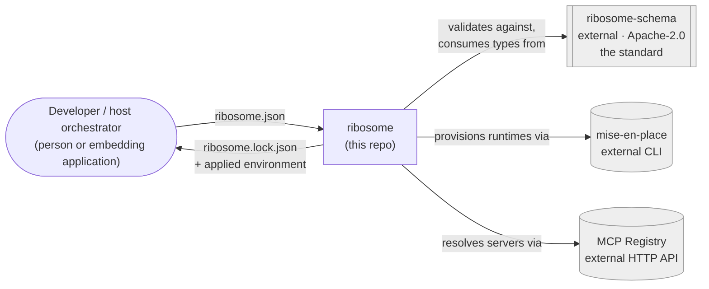
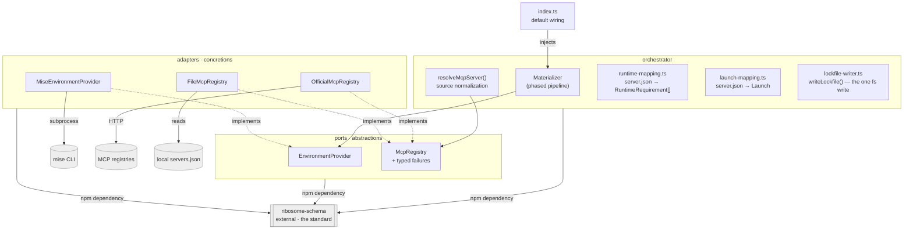
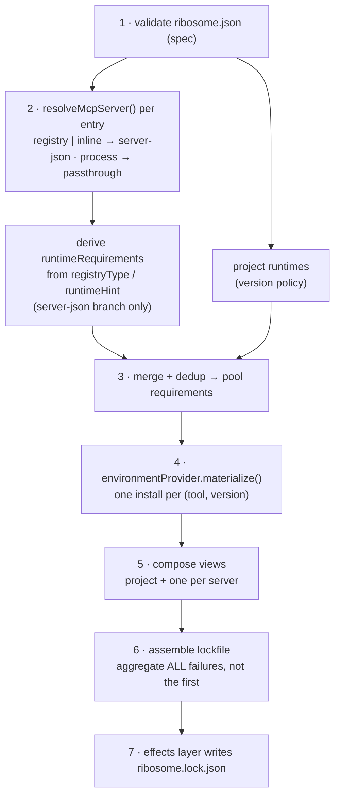

# Architecture

> Reference map of ribosome's design. If you're new here, read this top to
> bottom once; afterwards, the [dependency rules](#dependency-rules) and the
> [decision log](DECISIONS.md) are what you'll come back to.

## What ribosome is (and the niche it fills)

ribosome turns a **declaration** of a project's tools and MCP servers into
**working, materialized machinery** — up front, before any workflow runs, so a
missing tool or unresolvable server fails at validation time, not mid-execution.

The ecosystem already has runtime managers (mise, asdf, nix) and MCP clients
that read `server.json` and launch servers. **Nobody does the unified, upfront
materialization**: runtimes *and* MCP servers, resolved together, deduplicated
into a shared pool, pinned into one reproducible lockfile. That is ribosome's
niche.

Positioning rule of thumb: **conform on the config axis, compete on the runtime
axis.** ribosome is not "another way to list MCP servers" — its `mcpServers`
section is deliberately a compatible superset of existing formats. Its unique
value is the runtime provisioning those formats don't provide.

## Architecture at a glance

Two diagrams, following the [C4 model](https://c4model.com/)'s levels of
abstraction (Context, then Container) — Mermaid rather than the model's own
notation, since GitHub renders Mermaid code fences natively with no external
tool or stale image export, and a flowchart is more reliably rendered across
Mermaid versions than the newer, less consistently-supported `C4Context`/
`C4Container` diagram types. This pairing (C4 for structure, an ADR-style log
for rationale) is the same one used to keep the [decision log](DECISIONS.md)
meaningful instead of just a wall of text.

**Level 1 — Context.** ribosome as one box among the systems it talks to.
Everything on the standard/schema side is intentionally a single external
node here — its own internals are out of scope for *this* repo's diagram;
see [ribosome-schema](https://github.com/medullaflow/ribosome-schema) for that.



**Level 2 — Container.** Zoomed into ribosome itself: the ports & adapters
structure. The standard is still a single unexpanded box — it's a dependency
boundary, not something this diagram explains the inside of.



`runtime-mapping.ts`, `resolve-mcp-server.ts`, and `launch-mapping.ts` live in
`orchestrator/`, not `adapters/`, despite being about the MCP registry domain:
all three are pure logic over the standard's own types (`McpServerJson`), with
zero knowledge of a concrete registry or tool, so the orchestrator may depend
on them directly without violating [dependency rule 1](#dependency-rules).

Every arrow inside ribosome points **inward toward the orchestrator core**;
the concrete tools (mise, the registries) sit at the very edge, reachable
only through their own adapter.

## Two repos

The standard and the reference implementation are **separate repos with
separate licenses** — not a layering detail, a load-bearing decision.
Briefly, since the diagrams above already show
the boundary: **[ribosome-schema](https://github.com/medullaflow/ribosome-schema)**
(Apache-2.0) owns the normative JSON Schemas, the conformance corpus, and the
TypeScript binding (`@medullaflow/ribosome-schema`); this repo (MPL-2.0)
owns everything downstream of that — ports, adapters, orchestrator — and
depends on it as an ordinary published npm dependency (`^0.1.9`). It
carries no schema and no conformance fixtures of its own. For anything about
*how the standard itself* is versioned, vendored, or governed, that repo's
own docs are the source, not this file.

## Layers

ribosome is a [ports & adapters](https://alistair.cockburn.us/hexagonal-architecture/)
(hexagonal) design. Each layer is an **abstraction** plus one or more
**implementations**, and no layer is coupled to a concrete tool.

| Layer | Abstraction | Implementation | Responsibility |
|-------|-------------|----------------|----------------|
| **Spec** ([ribosome-schema](https://github.com/medullaflow/ribosome-schema), external) | Normative JSON Schemas + validation contract | validator (ajv), generated types, version pins | *The standard.* Source of truth for the manifest & lockfile formats. |
| **Ports** (`src/ports/`) | `EnvironmentProvider`, `McpRegistry` (+ its typed failure classes) | — (interfaces only) | The seams the orchestrator depends on. |
| **Adapters** (`src/adapters/`) | — | `MiseEnvironmentProvider`, `OfficialMcpRegistry`, `FileMcpRegistry` | The only code that knows mise / a concrete registry exists. |
| **Orchestrator** (`src/orchestrator/`) | `DependencyMaterializer` | `Materializer`, `resolveMcpServer()`, `deriveRuntimeRequirements()`, `deriveLaunch()`, `deriveProcessLaunch()`, `writeLockfile()` | Composes the layers into the phased pipeline; emits the lockfile. |

## Dependency rules

These four rules keep the design decoupled. Rules 1-3 are mechanically
enforced by the **architecture fitness function**
(`scripts/check-architecture.js`, pre-commit + CI — see
[#29](https://github.com/medullaflow/ribosome/issues/29)), which walks the
real import graph and fails the build on a forbidden edge; rule 4 is a
data-shape property, not an import-graph one, so it's covered instead by a
behavioral test (`test/materializer.test.ts`) plus the standard's own JSON
Schema:

1. **`ports/` imports nothing from `adapters/`.** Adapters import ports + the
   schema package; adapters never import each other. Neither imports anything
   from this repo *into* the schema package — that dependency only ever points
   one way (this last clause isn't independently checkable from this repo's
   own import graph — it's a property of ribosome-schema's repo instead).
2. **The orchestrator receives adapters by constructor injection** (a
   `EnvironmentProvider` and a list of `McpRegistry`). It never constructs a
   concrete adapter. Default wiring lives *only* in `index.ts`.
3. **The JSON Schema is authoritative; types are generated from it.** This is
   what lets other languages implement the standard — and it happens entirely
   inside ribosome-schema, not here. Checked here as a proxy: no local
   `*.schema.json` file anywhere in this repo.
4. **The lockfile is declarative and portable.** No shell/activation snippets
   leak into it (see [the activation-hook boundary](#the-activation-hook-boundary)).

## Data model

### The standard (generated from JSON Schema)

**`ribosome.json`** — the manifest:

```jsonc
{
  "$schema": "https://schema.ribosome.medullaflow.org/v1/manifest.schema.json",
  "schemaVersion": "1",
  "runtimes": { "node": "24", "python": "3.12" },
  "registries": {
    "default": "official",
    "sources": { "official": { "url": "https://registry.modelcontextprotocol.io" } }
  },
  "mcpServers": {
    "fs":     { "source": "registry", "name": "io.modelcontextprotocol/filesystem", "version": "1.2.0" },
    "custom": { "source": "inline",   "server": { /* a full server.json */ } },
    "legacy": { "source": "process",  "command": "npx", "args": ["-y", "@foo/bar"] }
  }
}
```

Three server sources, one internal descriptor:

- **`registry`** — a reference (`name` + optional `version` + `registry`)
  resolved against a named source. The registry's `server.json` determines
  runtime, transport, and launch.
- **`inline`** — a custom server described with a **complete standard
  `server.json`**, so it declares its own packages/runtime/env and resolves
  exactly like a registry server. Natural custom → publish-to-registry path.
- **`process`** — a raw `{ command, args, env }` launch, field-compatible with
  `.mcp.json` / editor MCP config for copy-paste migration. A compatibility
  bridge, not runtime-resolved.

**`ribosome.lock.json`** — the resolved output: a deduplicated `runtimePool`
plus one **declarative environment view** (`pathPrepend` + `envVars`) per
consumer (the project and each server).

### The ports (hand-written, internal to this repo — not part of the standard)

```ts
interface RuntimeRequirement { tool: string; versionSpec: string }
interface EnvironmentDelta extends Environment { activationHook?: string }
interface EnvironmentProvider {
  materialize(reqs: RuntimeRequirement[], ctx): Promise<PooledRuntime[]>; // effectful
  composeView(pool: PooledRuntime[], select: string[]): EnvironmentDelta;  // no new installs
}
interface McpRegistry {
  readonly type: string;                                  // matched to RegistrySource.type
  // Rejects with one of the typed failures below, never a generic Error —
  // part of the port's contract, so any future adapter (GitHub, Microsoft, ...)
  // and the orchestrator agree on the same failure shapes.
  resolve(query: RegistryQuery): Promise<McpServerJson>;
}
// RegistryUnreachableError | ServerNotFoundError | InvalidServerDescriptorError
// | MissingRegistryCredentialError
```

## The pool + views model

The single most important idea in the design:

- **Runtime pool** — *one per project*, deduplicated by `(tool, exact version)`.
  Ten MCP servers all needing `node@24` produce **one** pool entry, one install.
- **Environment views** — the project and *each* MCP server get their own view:
  a *selection* of pool entries composed into an env delta pointing at those
  specific entries. **Isolation at the environment level, deduplication at the
  install level.**

This is not imposed — it is how real backends already work (mise's shared
installs dir + PATH views; nix's shared store + per-consumer profiles). The
abstraction is native to them, which is what keeps ribosome uncoupled from any
one backend.

## The phased pipeline

Runtime requirements are discovered in two phases because **an MCP server's
runtime is determined by the registry, not the user**: resolving a `server.json`
reveals its `packages[].registryType`/`runtimeHint`, which imply the runtime
family (npm→node, pypi→python, nuget→dotnet, cargo→rust, oci→container). The
*version* comes from the project's `runtimes` (the version policy), or a
provider default when unpinned.



All seven steps are real now. Step 2 (`resolveMcpServer()`) shipped with the
MCP Registry Adapter milestone. Steps 3–6 — dedup, pooling, environment
views, and lockfile assembly — are `Materializer.materialize()`
([#23](https://github.com/medullaflow/ribosome/issues/23)), which is also the
first caller of `deriveLaunch()`
([#38](https://github.com/medullaflow/ribosome/issues/38)) for the `server-json`
branch, and of a sibling `deriveProcessLaunch()` for the `process` branch.
Step 7 —
`writeLockfile()` in `orchestrator/lockfile-writer.ts`
([#25](https://github.com/medullaflow/ribosome/issues/25)) — is the one place
in the whole pipeline that touches the filesystem: `materialize()` returns
the lockfile as a value and never writes it itself, so the resolution path
stays testable with zero filesystem access (`test/materializer.test.ts`),
and `writeLockfile()` is tested separately, against a real temp directory
(`test/lockfile-writer.test.ts`).

Resolution failures are **aggregated**: either everything resolves, or
`ResolutionError` lists every failure at once, so a caller reports them
together. `Materializer.materialize()` aggregates across every phase it
touches directly — descriptor resolution (step 2, including inline
`server.json` validation) and runtime provisioning (step 4) — rather than
stopping at the first failure ([#24](https://github.com/medullaflow/ribosome/issues/24)),
with each reported failure tagged by the
manifest entry (or tool) it came from.

## Purity and effects

Two kinds of side effects, only one of which is extractable:

- **Resolution effects** (`mise install`, registry HTTP) are intrinsic I/O and
  live *inside adapters*. The `EnvironmentProvider` must be allowed to install.
- **Persistence effects** (writing the lockfile) are extracted: the orchestrator
  is pure in its *logic* (merge, phasing, failure aggregation) and returns a
  lockfile *as data*; a thin effects step persists it.

Note that with the environment-provider abstraction, `mise.toml` is an
**internal detail of the mise adapter** — it is how that adapter talks to mise,
and appears nowhere else. A nix adapter would never write one.

### The activation-hook boundary

`EnvironmentDelta` carries an optional `activationHook` (a backend-specific shell
snippet, e.g. for nix/direnv) as an escape hatch for backends that don't reduce
to `PATH` + env vars. This hook is **internal to the port**. It is deliberately
**absent from the lockfile schema**, so `ribosome.lock.json` stays declarative
and portable across languages and platforms; the hook is re-derived by the
adapter when a lockfile is applied.

## Standard governance

Versioning (`schemaVersion`), vendoring external schemas (the MCP
`server.json` schema, pinned rather than referenced live), and the standard's
own release process are entirely owned by
[ribosome-schema](https://github.com/medullaflow/ribosome-schema) — this repo
only consumes the result as a dependency. See that repo's own docs for how any
of that works; duplicating it here would just be one more place for it to
go stale.

**Reproducibility is a property of the lockfile, not the manifest** — this
one *is* ribosome's own concern, not the schema's. With unpinned runtimes,
the *first* resolve is time-dependent (like `npm`/`cargo` with ranges); the
lockfile fixes it thereafter. Pin the runtimes your MCP servers rely on for
determinism from the first resolve.

## Design decisions

The dated, per-decision rationale log — *why* each of the choices above was
made, with the trade-offs weighed — lives in its own file:
**[DECISIONS.md](DECISIONS.md)**. It's a contributor-facing record, kept
separate so this page stays a design reference rather than a changelog.

